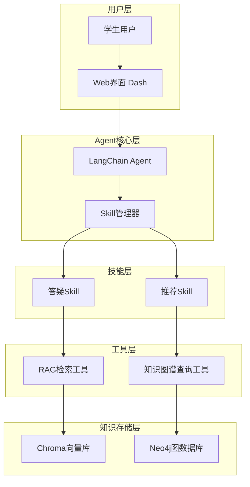

# Agentic AI for Science & Engineering Education - 设计文档

## 1. 系统设计概述

### 1.1 设计原则
- **范围收敛**：专注核心功能，确保一周内可演示
- **可演示优先**：界面友好，流程清晰，适合15分钟展示
- **技术栈对齐**：RAG + 知识图谱 + Agent Skills的协同设计
- **可扩展性**：预留接口，支持后续功能迭代

### 1.2 整体架构



### 1.3 核心组件说明

| 组件 | 职责 | 技术实现 |
|------|------|----------|
| **Web界面** | 用户交互、结果展示 | Dash/Plotly |
| **Agent核心** | 对话管理、工具调用决策 | LangChain AgentExecutor |
| **Skill管理器** | 技能发现、加载、触发 | 自定义Skill加载器 |
| **RAG工具** | 文档检索、引用生成 | Chroma + LangChain |
| **图谱工具** | 知识关系查询、推荐生成 | Neo4j + Cypher |
| **向量库** | 文档切片存储、语义检索 | Chroma |
| **知识图谱** | 知识点关系、先修依赖 | Neo4j |

## 2. 接口设计

### 2.1 Agent API接口

#### 2.1.1 对话接口
```http
POST /api/chat
Content-Type: application/json

{
  "session_id": "uuid-string",  // 可选，缺省时自动生成
  "message": "用户输入的问题"
}
```

**响应格式**：
```json
{
  "reply": "助手回复内容",
  "citations": [
    {
      "source": "lecture-08",
      "page": "15",
      "chapter": "Lecture 8: Fourier Transform",
      "content": "引用的原文片段"
    }
  ],
  "recommendations": [
    {
      "type": "learn",  // "learn" | "exercise"
      "target": "频域分析基础",
      "reason": "基于当前问题，建议先掌握频域分析的基本概念",
      "resource": "lecture-09"
    }
  ],
  "session_id": "uuid-string",
  "skill_used": ["qa", "exercise-recommend"],
  "processing_time": 2.5
}
```

#### 2.1.2 错误响应
```json
{
  "error": "rate_limit",  // 错误码
  "message": "请求过于频繁，请稍后再试",  // 用户友好的错误信息
  "details": "Rate limit exceeded: 10 requests per minute"  // 技术详情
}
```

**错误码定义**：
- `rate_limit`: 请求频率限制
- `model_error`: LLM服务错误
- `timeout`: 请求超时
- `invalid_input`: 输入格式错误
- `service_unavailable`: 服务不可用

### 2.2 内部组件接口

#### 2.2.1 RAG检索接口
```python
def retrieve_documents(
    query: str,
    top_k: int = 5,
    filters: Dict[str, Any] = None
) -> List[Document]:
    """
    检索相关文档片段
    
    Args:
        query: 查询文本
        top_k: 返回文档数量
        filters: 元数据过滤条件，如 {"chapter": "lecture-08"}
    
    Returns:
        Document列表，包含content和metadata
    """
```

#### 2.2.2 知识图谱查询接口
```python
def query_prerequisites(topic_id: str) -> List[str]:
    """查询知识点的先修要求"""

def query_recommendations(topic_id: str, difficulty: str = None) -> List[Dict]:
    """查询推荐的下一步学习内容"""

def query_exercises(topic_id: str) -> List[Dict]:
    """查询相关练习题目"""
```

## 3. 数据模型设计

### 3.1 向量库数据模型

#### 3.1.1 文档切片Metadata
```json
{
  "source": "lecture-08",           // 来源标识
  "page": 15,                      // 页码
  "chapter": "Lecture 8",          // 章节
  "section": "8.2",               // 小节
  "content_type": "lecture",       // 内容类型: lecture|homework|solution
  "difficulty": "intermediate",    // 难度: basic|intermediate|advanced
  "topics": ["fourier_transform", "frequency_domain"],  // 相关主题
  "chunk_index": 3,               // 切片索引
  "total_chunks": 12              // 总切片数
}
```

#### 3.1.2 切片策略
- **切片大小**：300-800字符，重叠50-100字符
- **切片边界**：避免在公式、句子中间切断
- **元数据保留**：每个切片保留完整的来源信息

### 3.2 知识图谱数据模型

#### 3.2.1 节点类型

**Topic节点**：
```cypher
CREATE (t:Topic {
  id: "fourier_transform",
  name: "傅里叶变换",
  name_en: "Fourier Transform",
  order: 8,                    // 讲次顺序
  difficulty: "intermediate",
  description: "信号的频域表示方法",
  mastery_level: 0.0          // 预留：掌握度 0.0-1.0
})
```

**Exercise节点**：
```cypher
CREATE (e:Exercise {
  id: "hw08_01",
  title: "计算信号的傅里叶变换",
  difficulty: "intermediate",
  source: "homework-08",
  problem_type: "calculation"
})
```

#### 3.2.2 关系类型

**先修关系**：
```cypher
CREATE (t1:Topic)-[:PREREQUISITE {strength: 0.8}]->(t2:Topic)
```

**覆盖关系**：
```cypher
CREATE (t:Topic)-[:COVERS {relevance: 0.9}]->(e:Exercise)
```

**推荐关系**：
```cypher
CREATE (t1:Topic)-[:RECOMMENDS {reason: "natural_progression"}]->(t2:Topic)
```

### 3.3 会话数据模型

#### 3.3.1 JSONL格式
```json
{
  "session_id": "uuid-string",
  "timestamp": "2026-02-04T10:30:00Z",
  "role": "user",
  "content": "什么是傅里叶变换？",
  "metadata": {"ip": "127.0.0.1"}
}
{
  "session_id": "uuid-string",
  "timestamp": "2026-02-04T10:30:05Z",
  "role": "assistant",
  "content": "傅里叶变换是...",
  "metadata": {
    "citations": [...],
    "recommendations": [...],
    "processing_time": 2.5,
    "skills_used": ["qa"]
  }
}
```

## 4. Skill设计

### 4.1 Skill架构

#### 4.1.1 目录结构
```
skills/
├── qa/
│   ├── SKILL.md              # 技能定义
│   ├── templates/
│   │   └── citation_format.md
│   └── references/
│       └── guidelines.md
└── exercise-recommend/
    ├── SKILL.md
    ├── templates/
    │   └── recommendation_format.md
    └── references/
        └── difficulty_levels.md
```

#### 4.1.2 SKILL.md格式
```yaml
---
name: "答疑助手"
description: "基于课程材料回答学生问题并提供引用"
trigger_keywords: ["什么是", "如何", "为什么", "解释", "help", "explain"]
allowed_tools: ["rag_retrieve", "format_citation"]
priority: 1
---

# 答疑Skill使用指南

## 职责
基于《信号与系统》课程权威材料回答学生问题，优先提供概念解释和推理过程。

## 输出要求
1. 回答必须包含引用来源（章节/页码）
2. 优先概念解释，后给结论
3. 可选择性使用苏格拉底式追问
4. 不编造不存在的内容

## 引用格式
参见 templates/citation_format.md
```

### 4.2 答疑Skill设计

#### 4.2.1 核心流程
1. **问题理解**：分析用户问题的知识点和意图
2. **文档检索**：使用RAG工具检索相关材料
3. **答案生成**：基于检索结果生成回答
4. **引用格式化**：标准化引用格式
5. **质量检查**：验证答案的准确性和完整性

#### 4.2.2 引用格式规范
```
根据课程材料，傅里叶变换是将时域信号转换为频域表示的数学工具...

**参考资料**：
- 第8讲：连续时间傅里叶变换，第15页
- 作业8：傅里叶变换计算，第3题
```

### 4.3 推荐Skill设计

#### 4.3.1 推荐策略
1. **基于先修关系**：检查用户当前问题涉及的知识点
2. **难度递进**：推荐适当难度的下一步内容
3. **关联性分析**：找出相关的练习题目
4. **个性化调整**：基于用户历史问题调整推荐

#### 4.3.2 推荐类型
- **概念学习**：推荐相关理论知识点
- **练习巩固**：推荐对应的习题
- **深入学习**：推荐高级主题
- **回顾复习**：推荐先修知识点

### 4.4 多Skill协同策略

#### 4.4.1 双Skill同时触发处理
当用户问题同时触发答疑和推荐Skill时，首版采用**合并回答**策略：

1. **执行顺序**：先执行答疑Skill，再执行推荐Skill
2. **回答结构**：
   ```
   [答疑内容]
   基于课程材料，[概念解释和推理过程]...
   
   **参考资料**：
   - [引用来源1]
   - [引用来源2]
   
   **推荐学习**：
   - [推荐内容1]：[推荐理由]
   - [推荐内容2]：[推荐理由]
   ```

3. **实现原则**：
   - 不做Skill互斥逻辑，允许多Skill协同工作
   - 保持回答的连贯性和逻辑性
   - 在system prompt中明确说明合并回答的顺序和格式

#### 4.4.2 异常情况处理
- **RAG无结果**：回复中包含"未在课程材料中找到直接相关内容"的说明
- **图谱无推荐**：返回空推荐列表，说明"暂无针对性的下一步推荐"
- **LLM超时**：返回友好错误提示，如"服务暂时繁忙，请稍后再试"

## 5. 用户界面设计

### 5.1 Web界面布局

```
┌─────────────────────────────────────────────────────┐
│                 信号与系统AI助手                      │
├─────────────────────────────────────────────────────┤
│  会话历史                    │  知识图谱可视化        │
│  ┌─────────────────────────┐ │  ┌─────────────────┐  │
│  │ 用户: 什么是傅里叶变换？  │ │  │    [节点图]     │  │
│  │                         │ │  │                 │  │
│  │ 助手: 傅里叶变换是...    │ │  │                 │  │
│  │ 📚 参考: 第8讲 第15页   │ │  │                 │  │
│  │ 💡 推荐: 频域分析基础   │ │  │                 │  │
│  └─────────────────────────┘ │  └─────────────────┘  │
├─────────────────────────────────────────────────────┤
│  输入框: [请输入您的问题...]              [发送]      │
├─────────────────────────────────────────────────────┤
│  状态栏: 当前使用技能: 答疑 | 响应时间: 2.3s         │
└─────────────────────────────────────────────────────┘
```

### 5.2 交互设计要点

#### 5.2.1 实时反馈
- 显示"正在思考..."状态
- 展示技能选择过程
- 显示检索和推理步骤

#### 5.2.2 结果展示
- 清晰的答案和引用分离
- 推荐内容的理由说明
- 可点击的引用链接

#### 5.2.3 会话管理
- 支持多个会话标签
- 会话历史保存和加载
- 会话分享功能

## 6. 性能设计

### 6.1 响应时间优化

#### 6.1.1 缓存策略
- **向量检索缓存**：常见问题的检索结果
- **图谱查询缓存**：知识点关系查询结果
- **LLM响应缓存**：相似问题的回答

#### 6.1.2 并发处理
- 异步处理RAG检索和图谱查询
- 流式响应，逐步返回结果
- 连接池管理数据库连接

### 6.2 可扩展性设计

#### 6.2.1 水平扩展
- 无状态Agent设计
- 外部会话存储
- 负载均衡支持

#### 6.2.2 模块化设计
- 可插拔的Skill系统
- 可替换的存储后端
- 可配置的模型选择

## 7. 安全设计

### 7.1 数据安全
- 仅使用公开教育材料
- 不存储敏感个人信息
- 会话数据定期清理

### 7.2 访问控制
- API请求频率限制
- 输入内容过滤
- 错误信息脱敏

### 7.3 容错设计
- 优雅的服务降级
- 备用模型切换
- 详细的错误日志

## 8. 部署设计

### 8.1 开发环境
```bash
# 环境准备
conda create -n agent-edu python=3.11
conda activate agent-edu
pip install -r requirements.txt

# 服务启动
python -m uvicorn main:app --reload --port 8000
```

### 8.2 生产环境
- Docker容器化部署
- 环境变量配置管理
- 健康检查和监控

### 8.3 数据库部署
- Neo4j社区版或Docker部署
- Chroma本地存储或云服务
- 数据备份和恢复策略

## 9. 测试设计

### 9.1 单元测试
- Skill功能测试
- 工具接口测试
- 数据模型验证

### 9.2 集成测试
- 端到端对话流程
- 多技能协同测试
- 异常情况处理

### 9.3 性能测试
- 响应时间基准测试
- 并发用户压力测试
- 内存和CPU使用监控

## 10. 监控和日志

### 10.1 关键指标
- 响应时间分布
- 技能使用统计
- 错误率和类型
- 用户满意度

### 10.2 日志设计
```python
{
  "timestamp": "2026-02-04T10:30:00Z",
  "level": "INFO",
  "component": "agent",
  "session_id": "uuid",
  "event": "skill_triggered",
  "data": {
    "skill": "qa",
    "query": "什么是傅里叶变换",
    "processing_time": 2.3,
    "citations_count": 2,
    "recommendations_count": 1
  }
}
```

## 11. 正确性属性

基于需求分析，系统必须满足以下正确性属性：

### 11.1 引用准确性属性
**属性1.1**：所有回答中的引用必须对应真实存在的课程材料
- **形式化**：∀ citation ∈ response.citations → ∃ document ∈ knowledge_base
- **测试策略**：验证每个引用的source、page、chapter字段都能在原始材料中找到对应内容

### 11.2 推荐一致性属性  
**属性1.2**：推荐的学习内容必须符合知识图谱中的先修关系
- **形式化**：∀ recommendation → prerequisite_satisfied(current_topic, recommended_topic)
- **测试策略**：检查推荐路径是否违反先修依赖关系

### 11.3 会话连续性属性
**属性1.3**：同一会话内的多轮对话必须保持上下文一致性
- **形式化**：context(turn_n) ⊆ context(turn_n+1)
- **测试策略**：验证后续回答能够引用前面对话中的概念和结论

### 11.4 技能选择正确性属性
**属性1.4**：系统必须根据用户输入正确选择和触发相应的技能
- **形式化**：trigger_keywords(input) → correct_skill_activated
- **测试策略**：使用包含特定关键词的测试用例验证技能触发逻辑

这些属性将通过属性基测试（Property-Based Testing）进行验证，确保系统在各种输入条件下都能保持正确的行为。