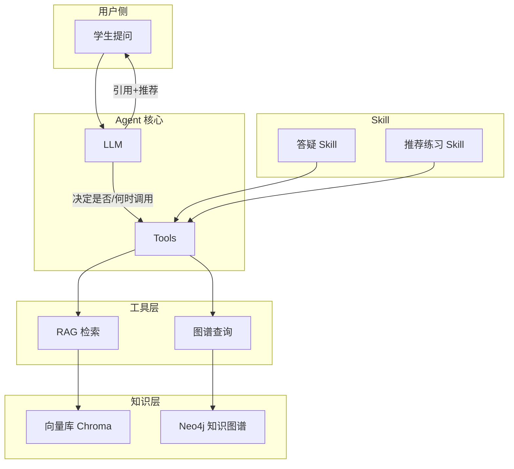
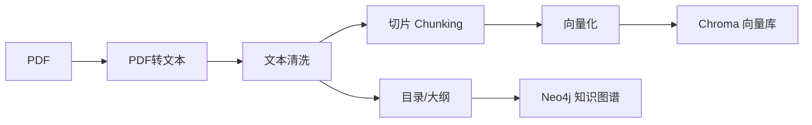
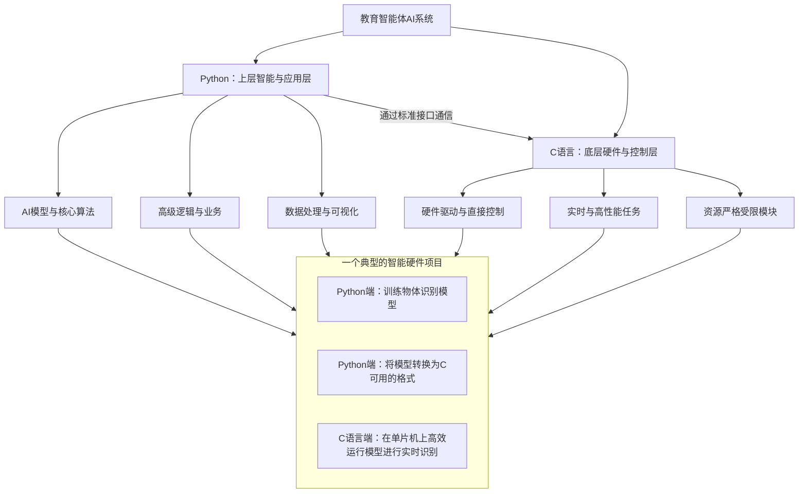
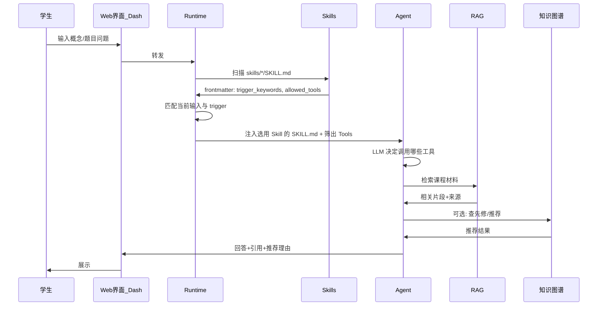
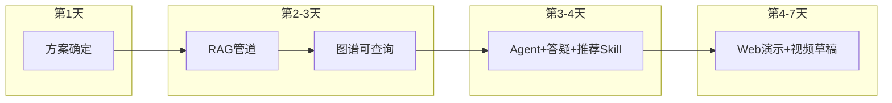

# Agentic AI for Science & Engineering Education — 初版方案讨论

> 基于项目目标与调研形成的初版方案，供讨论与迭代。目标：在一周内可落地的、可演示、可提交的 Science & Engineering 教育 AI 助手。  
> **项目背景**：hackAstone 赛事（Agentic AI for Education），15 分钟/队展示，提交 8 分钟视频 + 项目描述；注册截止 2026-02-28，半决赛提名 2026-06-01，正式提交 2026-07-01，决赛 2026-10 阿姆斯特丹。  
> **仓库**：https://github.com/GoingFall/Agentic-AI-for-Education  
> **功能设计通俗版**：另有一份面向非软工组员的简化说明（功能设计说明-非技术版），用大白话描述「做什么、不做什么」；若同组仅收到本文档，可据此讨论技术方案，通俗版可后续补发。

---

## 1. 项目目标与约束

| 维度 | 说明 |
|------|------|
| **赛事定位** | hackAstone：Agentic AI for Education；团队项目：Agentic AI for **Science & Engineering** Education。 |
| **展示要求** | 15 分钟/队（含 Q&A）；提交含 8 分钟项目视频 + 项目描述。 |
| **时间约束** | 一周内完成核心可演示版本，后续迭代至 6 月提名、7 月正式提交。 |
| **设计原则** | 范围收敛、可演示优先、技术栈与 research 对齐（RAG + 知识图谱 + Skill）。 |

---

## 2. 目标用户与核心场景（初版收敛）

建议**先收敛到单一主场景**，便于一周内做出「完整闭环」的演示：

- **主场景**：**科学/工程某一门课（或一个知识域）的「答疑 + 练习推荐」助手**
  - 学生用自然语言提问（概念、解题思路、实验步骤等）。
  - Agent 基于**课程权威材料**回答并**引用来源**（RAG）；回答时**优先概念解释与推理过程**（即先讲清概念与推理再给结论，概念理解优先），并**显式展示推理步骤**（如先讲概念再推公式再给结论），便于学生检查逻辑、识别疏漏；首版在 prompt 中要求「分步呈现」，可选后续做结构化输出（步骤列表）。首版以引用与推荐为主。**苏格拉底式追问**：不直接给答案，而是通过引导性提问（如「你觉得这里该用哪个公式？」「先修知识点里哪一步还没掌握？」）让学生自己推理、发现疏漏，从而加深理解；可在提示词中要求助手在合适时机采用该方式，首版以「先给解释与引用」为主，追问作为可选交互原则。**设计上**明确「不直接给答案、通过提问促学生自己推导」的触发时机与提示词策略，与 Khanmigo 等产品对齐（与 product_research 中 Khanmigo 结论一致）。
  - 在合适时机**推荐下一步学习或练习**（可由简化版知识图谱或规则驱动）。设计上**预留「因薄弱点推荐」**（与 §3 知识图谱预留的掌握度/薄弱点一致）；首版用先修+规则推荐，后续可接入认知诊断与个性化路径（与 product_research 中因材施教/薄弱点规划等结论一致）。设计上希望有利于**情境兴趣与持续学习意愿**（如通过分步呈现与推荐降低挫败感），与教育技术文献中的学习效果维度一致（参见 [papers.md](docs/papers.md)）；首版不落地评估指标。
- **协助学习**（**可选**，时间允许再做）：**通过硬件扫描仪，扫描课程材料\输入教材电子版（如 PDF）→ 输出知识框架**（章节目录、知识点与先修关系等），便于学生快速把握全书结构。首版优先答疑 + 推荐练习；「电子版 → 知识框架」管道（§3.3.1 预处理 + 从目录/大纲整理图谱）为扩展项，排期不占必做；后续可支持用户上传自选教材并生成对应框架。
- **可选扩展**（时间允许再加）：简单学情小结（如「你常问的是哪几类题」）。

**不放在首版**（以下均留作后续扩展，首版不做以控制范围与合规风险）：
- **多课并行**：同时支持多门课程（如《信号与系统》+《数字信号处理》），按课程切换语料与图谱。首版只做单课《信号与系统》。
- **成绩录入**：对接教务系统或教师录入的成绩，用于学情分析、薄弱点诊断等。涉及真实成绩数据与隐私，首版不接。
- **LMS 深度集成**：与学习管理系统（Learning Management System，如 Moodle、Canvas、学堂在线）深度打通（单点登录、作业同步、成绩回写等）。首版为独立演示应用，不依赖具体 LMS。
- **开放学生账号体系**：学生注册、登录、个人学习记录与多设备同步等。首版采用匿名多会话（session_id 用 UUID），不要求注册与登录。
- **VR/AR、严肃游戏、仿真与数字孪生教育**：沉浸式实验、仿真操作、严肃游戏、数字孪生教学等（与 [papers.md](docs/papers.md) 中 VARTeL、STEM 仿真与严肃游戏、数字孪生教育等对应）。首版为文本对话型助手，上述为后续或合作扩展方向。

### 2.1 功能设计补充（参考产品调研）

以下从 [product_research.md](../research/product_research.md) 提炼与功能直接相关的设计要点，并标明在本项目中的**落地状态**（已覆盖 / 首版做 / 可选 / 预留），便于与行业实践对齐与追溯。

| 维度 | 产品调研要点 | 本项目落地状态 |
|------|--------------|----------------|
| **教学法** | 苏格拉底式、概念优先、推理可见、多步推理 | 首版：概念优先 + 引用 + 分步呈现；追问与多步推理为可选/预留。 |
| **权威与幻觉** | RAG 权威语料、置信度/主动拒绝、自校验 | 首版：RAG + 引用；自校验与置信度预留（§3）。 |
| **个性化与诊断** | 薄弱点、因材施教、复习路径 | 首版：先修 + 规则推荐；薄弱点与路径预留（§2、§3 图谱与 UI）。 |
| **教育治理** | 教学目标导向、人类主体性、隐私、可解释性 | 首版：只读工具、匿名会话、引用与理由可追溯；人类主体性（评分/关键决策保留给人）在设计说明中体现。 |
| **学习体验与效果（papers/VARTeL）** | 情境兴趣、自我效能感、持续学习意愿；沉浸式、协作、交互式学习 | 首版：通过多轮对话、分步推理、引导提问与推荐下一步体现**交互式、协作（人机协同）**；**情境兴趣/自我效能感/持续学习意愿**作为学习效果维度预留，首版不测，后续可与教育评估对接。沉浸式（VR/AR）、严肃游戏、仿真不占首版。**后续研究方向**：可引入模拟学生 agent + 基于代理指标的优化闭环（如强化学习/bandit）验证与优化上述维度，详见 §3.1「后续研究方向（可选）」。 |

---

## 3. 技术方案（与 research 对齐）

### 3.1 整体架构（参考 OpenClaw 思路，但做教育收敛）



- **Agent 核心**：单一主循环 + 工具调用（检索、查图谱、调用 Skill），不做多 Agent 编排，保证可调试、可演示。**是否调用 RAG/图谱及调用顺序由 Agent（LLM）根据当前用户问题自主决定**，不强制先 RAG 再推荐。首版为**单轮工具调用为主**，设计上支持多步（如先 RAG 再图谱再生成）；若后续做复杂推理链，需设最大步数并监控工具调用成功率（与 product_research 中多步规划、工具调用成功率等指标可作后续对标）。
- **知识层**：
  - **RAG**：一门课（或一个知识域）的教材/大纲/实验说明等 → 切片、向量化 → 向量库；回答时检索 + 引用。RAG 除提供引用外，**用于降低幻觉**（以课程权威材料为界，不编造来源；与 product_research 中 RAG 降幻觉等结论一致）；首版不强制多智能体校验，可预留「关键结论二次校验」扩展。
  - **知识图谱（简化版）**：先做「知识点 + 先修关系 + 可选难度」的图，用于「下一步学什么 / 练什么」的推荐；**首版直接使用 Neo4j** 存储，不必上完整 RDF/SPARQL。**设计上预留「认知诊断/薄弱点」**：图谱或学习者模型预留「掌握度/薄弱点」等字段，推荐理由与 UI 预留「因薄弱点推荐」的展示位，具体诊断逻辑后续迭代。
  - **分工**：RAG 负责段落级检索与生成，图谱负责结构与先修/推荐，二者协同（RAG 给「段落证据」，图谱给「先修/推荐逻辑」）。若时间允许，可为生成答案增加**反思/自校验**（如对单位、公式、逻辑一致性做一次检查），在呈现给学生前做校验，避免明显科学错误；首版不做硬性要求。设计上**预留「置信度/不确定性」**：对公式、单位、逻辑做自检，必要时在回复中标注「此处建议再核对教材第 X 页」或主动拒绝超出课程范围的问题（与 product_research 中置信度校准与主动拒绝等结论一致）。
- **工具与扩展**：
  - **Skill**：首版**两个**教育 Skill 为**答疑**（RAG + 引用）与**推荐练习**（图谱/规则 + 简单筛选），**均为必做**；按 Agent Skills 开放规范（SKILL.md + 按需加载），先做核心再扩展。首版不做 MCP，后续可扩展。
- **安全与权限**：仅教学相关数据、脱敏或样例数据；不接真实教务/成绩系统，避免合规与隐私风险；教育场景严格限制可执行范围（仅只读工具）。

#### 后续研究方向（可选）

为验证与优化「情境兴趣、自我效能感、持续学习意愿」等学习效果维度，可考虑引入**模拟人类操作的 agent + 强化学习（或类似优化方法）**，在仿真中优化系统并验证可行性，再开展真人评估。

**思路概要**：

- **模拟学生 agent**：用 LLM 驱动的 agent 模拟学生在系统内的操作（提问、阅读回答、点击推荐、继续或离开等），可赋予不同人设（如易挫败型、爱追问型）与简单状态（当前主题、轮数、是否已要过推荐），生成大量交互轨迹。
- **代理指标（proxy）**：在轨迹上定义与上述维度对应的可观测指标，例如——情境兴趣：同一会话内追问次数、是否点「推荐下一步」；自我效能感：是否尝试更难的题或主动要练习；持续学习意愿：模拟「下次还会来」或会话长度/轮数。用这些指标构造奖励信号。
- **优化与验证**：将助教侧策略（如何时苏格拉底式追问、推荐时机与话术、分步讲解粒度）视为可调策略，通过强化学习、bandit 或贝叶斯优化等更新策略；在模拟中比较优化前后代理指标是否提升，从而在真人实验前**验证设计可行性**、低成本试错 prompt 与规则。
- **局限**：模拟与真人存在 gap，仿真结论需真人实验与真实学习效果指标最终验证。

首版不实现上述内容，不纳入里程碑；仅作后续研究或扩展方向记录。

### 3.2 技术选型（建议）

向量库/图库具体产品可据团队熟悉度与下文工程参考选定，下表为建议组合。

| 层级 | 建议 | 说明 |
|------|------|------|
| **LLM** | **OpenRouter API**，模型 **openai/gpt-oss-120b** | 统一经 OpenRouter 调用；key 从 `.env` 的 `OPENROUTER_API_KEY` 读取；便于后续在同一入口切换其他模型。 |
| **向量库** | Chroma | 实现「切片 → 向量化 → 向量库」的 RAG 流程；Chroma 为建议选项，可替换为团队熟悉的向量库。 |
| **知识图谱** | Neo4j | 存储「实体—关系、先修、推荐」；首版**直接使用 Neo4j**。Neo4j **部署方式**（本地/Docker/云等）实现时按环境与团队习惯选择，本文不约定具体方案。 |
| **Agent 运行时** | 基于 LangChain | 单循环 + 工具调用、与 RAG/向量库集成、便于快速上线；若后续需要更强流程控制可再评估 LangGraph。本项目具体使用 LangChain 的环节见下文 §3.2.1。 |
| **Skill** | 按 Agent Skills 规范（SKILL.md + 可选 scripts） | 可插拔、可版本管理；首版**两个**教育 Skill（答疑、推荐练习）**均为必做**。 |

### 3.2.1 本项目使用 LangChain 的环节

| 环节 | 用途 | 对应 LangChain 组件/用法 |
|------|------|---------------------------|
| **LLM 调用** | 经 **OpenRouter API** 发起对话与生成，首版模型 **openai/gpt-oss-120b** | `langchain_openai.ChatOpenAI` 配置 `model="openai/gpt-oss-120b"`、`openai_api_base="https://openrouter.ai/api/v1"`、`openai_api_key` 从环境变量读取；项目内测试脚本 `test/test_openrouter_connection.py` 已用于验证 OpenRouter 连接。 |
| **RAG：文档加载与切片** | PDF/文本 → 可检索的文本块（带 metadata） | `DocumentLoaders`（如 `PyPDFLoader`、`Unstructured`）、`RecursiveCharacterTextSplitter` 或 `MarkdownHeaderTextSplitter`；详见下文 §3.3.1 预处理。 |
| **RAG：向量存储与检索** | 切片写入向量库、按问题检索相关片段 | `Embeddings` + `VectorStore`（如 Chroma 与 LangChain 集成）、`vectorstore.as_retriever()`，检索结果作为生成时的 context。 |
| **Agent 编排** | 单循环：接收用户输入 → 选工具（RAG/图谱）→ 调用 LLM → 返回回答 | `create_agent`（或 `create_tool_calling_agent`）+ `AgentExecutor`，或 LCEL 链；system_prompt、tools 列表由 config/Skill 驱动。 |
| **工具（Tools）** | 把「查 RAG」「查图谱」等封装成 Agent 可调用的工具 | `@tool` 定义函数，将 RAG retriever、Neo4j 查询等封装为 Tool，传入 Agent；答疑用 RAG 工具，推荐用图谱工具。 |
| **多轮记忆** | 同一会话内保留历史消息，实现连续对话 | `ChatMessageHistory` + `RunnableWithMessageHistory`，按 `session_id` 区分用户；首版支持**多会话**，`session_id` 由 **UUID** 生成，匿名、不要求登录；可选 Redis/PostgreSQL 持久化。 |
| **简单链（可选）** | 固定流程如「检索 → 拼 context → 生成」 | LCEL：`prompt \| llm \| StrOutputParser()`，或 `ChatPromptTemplate` + `MessagesPlaceholder`；用于非 Agent 的纯 RAG 问答时可选用。 |

以上环节均可在保持「单 Agent + 工具」的前提下用 LangChain 实现；若需强可控的步骤与分支，可再引入 **LangGraph**。

### 3.3 数据与内容范围（首版）

首版选定 **《信号与系统》**。

- **RAG 语料**：该课的**公开/样例**材料（大纲、若干章教材、实验说明等）；统一格式（如 Markdown/PDF 转文本），切片后建索引。
- **知识图谱**：《信号与系统》知识点列表 + 先修关系 + 可选标签（难度/类型）；可由大纲与教材人工整理或半自动抽取。首版实现「先修 + 推荐」；**预留扩展**：节点或学习者侧可预留「掌握度/薄弱点」字段，推荐接口与前端预留对应展示位，便于后续接入认知诊断。
- **习题/推荐**：若做「推荐练习」，可用少量该课样例题目 + 与知识点的关联；真实题库对接留作后续。

**首版数据源**：本仓库 **data/res.6-007-spring-2011**（MIT OCW RES.6-007 Signals and Systems, Spring 2011），与首版课程《信号与系统》一致，经讨论可**支撑**当前场景。

| 项目需求 | 该数据集是否满足 | 说明 |
|----------|------------------|------|
| **RAG 语料** | ✅ 满足 | 26 讲 lecture notes PDF（lec01–lec26），每讲有 title、description、file 等 metadata；另有 26 份作业 PDF + 26 份答案 PDF，可作答疑与推荐语料。`pages/lecture-notes/data.json` 提供完整目录（LEC # + TOPICS），便于切片时标注 chapter/section。 |
| **知识图谱** | ✅ 满足 | 26 讲顺序即天然先修关系；可从目录得到知识点列表，按「讲序」建节点与边。难度/类型可人工或按 resource_type 打标签。 |
| **习题/推荐** | ✅ 满足 | hw01–hw26 与 hw*_sol，每份在对应 resource 的 data.json 中有 title、description；可按「第 N 讲 ↔ 第 N 次作业」建立习题与知识点关联，用于推荐练习。 |

**实现注意**：资源内 `file` 为 OCW 风格路径；实际 PDF 在 `data/.../static_resources/` 下（文件名带 UID 前缀），预处理时需用 `content_map.json` 与各 resource 的 `data.json` 做「资源 ↔ 文件」映射。材料为英文；若产品以中文答疑，由 LLM 在检索后以中文作答即可。

### 3.3.1 原始材料预处理（PDF → RAG / 图谱）

原始材料为 **PDF** 时，建议按以下流程预处理，便于建 RAG 索引与引用、以及后续整理知识图谱。



| 步骤 | 目的 | 做法与可选工具 |
|------|------|----------------|
| **1. PDF → 文本** | 抽出可检索的正文，尽量保留章节结构 | **工具**：`PyMuPDF`(fitz)、`pdfplumber`、LangChain 的 `PyPDFLoader` 或 `Unstructured`。扫描版需 OCR（如 `pytesseract` + `pdf2image`）。输出时**带页码**（每页或每段记 `page`），便于回答时标明「第 X 页」。 |
| **2. 文本清洗** | 减少乱码、断行、页眉页脚对切片和检索的干扰 | 去掉页眉页脚、多余空行；表格/公式若被拆散可后处理合并或单独成块；**保留**章节标题（如「1.2 傅里叶变换」）以便按结构切片。 |
| **3. 切片（Chunking）** | 适配向量检索与上下文长度，且便于「引用到段落」 | 按**段落或小节**切，避免在公式/句子中间切断；每块建议 **300～800 字**（或按 token 估算），块间可 **overlap 50～100 字** 避免边界信息丢失。**每块附带 metadata**：`source`（文件名）、`chapter`/`section`、`page`，供 RAG 返回「见第 X 章 / 第 Y 页」。LangChain：`RecursiveCharacterTextSplitter` 或按标题的 `MarkdownHeaderTextSplitter`。 |
| **4. 向量化并写入向量库** | 供 RAG 检索 | 用选定嵌入模型对每块做向量，写入 Chroma（或当前技术选型中的向量库）；**metadata 一并写入**，检索时返回内容 + 来源，用于生成回答与引用。 |
| **5. 知识图谱用结构** | 先修关系、推荐逻辑 | 用**大纲/目录 + 人工整理**得到「知识点列表 + 先修关系 + 难度/类型」；可从 PDF 目录或清洗后的标题层级导出，再**录入 Neo4j**。 |

**输出与约定**：

- **RAG 侧**：切片后的文本块 + 统一 metadata（如 `source`, `page`, `chapter`），保证回答时可说「参见教材第 X 页」。
- **图谱侧**：首版可由大纲/目录得到章/节/知识点名，再人工补先修与标签；PDF 预处理只需保证「能导出或标注章节结构」即可。

**首版可简化**：若时间紧，可先做「PDF → 文本（带页码）→ 按页或按节切片 → 向量库」；引用先到「第 X 页」再细化到章节。

**与「协助学习」的对应**：上述「PDF → 文本 → 切片 + 目录/大纲 → 知识图谱」即**「输入教材电子版 → 输出知识框架」**的实现路径；首版对《信号与系统》跑通后，可在界面提供「查看本书知识框架」等入口，后续扩展为「用户上传 PDF → 生成该书的框架」。

### 3.4 工程实现参考

以下实现或思路可直接支撑首版「单循环 + 工具 + Skill」方案，或作为扩展/备选参考（原出自 research 下的 LangChain、CrewAI、OpenClaw、OpenCode、Skill 等调研）。

| 来源 | 可参考的实现或思路 |
|------|---------------------|
| **LangChain** | **编排**：LCEL 链（`prompt \| llm \| StrOutputParser()`）、`create_agent(model, tools, system_prompt)` + `invoke`；**RAG**：DocumentLoaders → TextSplitter → Embeddings → VectorStore，`vectorstore.as_retriever()` 作 context；**记忆**：`ChatMessageHistory` + `RunnableWithMessageHistory`，按 `session_id` 多轮；**工具**：`@tool` 定义、Agent 按需调用。若需固定步骤或强可控流程，可再评估 **LangGraph**。 |
| **CrewAI** | **多角色备选**：Agent(role/goal/backstory) + Task(description/context) + Crew(process: sequential/hierarchical)；YAML/代码定义；**Knowledge**：Agentic RAG、向量库查询等。首版以单 Agent + Skill 为主；若需演示「答疑 Agent + 推荐 Agent」分工，可用 CrewAI 作备选实现。**可融入本项目的工程设计**见下 §3.4.1。 |
| **OpenClaw** | **架构**：本地网关 → 渠道适配 → AI 运行器（动态组装系统提示：工具+技能+记忆+会话历史）→ LLM → **智能体循环**（工具调用 → 本地执行 → 结果回对话，直至无工具调用）。**记忆**：JSONL 会话 + `memory/*.md` 长期；**检索**：向量 + 关键词混合。**可借鉴**：动态系统提示、上下文快满时总结压缩、命令/工具审批（ask/allow/deny）；教育场景需严格限制权限与数据范围。**本项目可参考的工程实现**见 §3.4.2。 |
| **OpenCode** | **权限与模式**：Build（全权限）/ Plan（只读规划）双模式；主 Agent + 子 Agent（@ 调用），工具逐项开关（write/edit/bash），**permission** 细粒度（ask/allow/deny）。**配置**：Agent 用 Markdown/JSON，prompt 可 `{file:./path}`。**演示友好**：分享链接、多会话、`/compact` 压缩会话。可借鉴「规划与执行分离」与工具权限设计。**本项目可参考**见 §3.4.3。 |
| **Skill 规范** | **形态**：目录内 `SKILL.md`（YAML：name, description）+ 可选 `scripts/`、`references/`、`templates/`；**触发**：description + `trigger_keywords` 提升自动选用率；按需加载控制上下文。**分层**：Skill 管「做什么、按什么流程」，MCP 管「连什么数据、调什么接口」。教育 Skill：答疑（RAG+引用）、推荐练习（图谱/规则）；题型模板、评分细则放 templates/references。 |

### 3.4.1 CrewAI 工程设计可融入本项目的部分

在保持「单 Agent + LangChain + Skill」的前提下，以下 **CrewAI** 的工程设计可借鉴并融入实现，无需换成 CrewAI 框架。

| CrewAI 设计 | 融入方式（本项目） |
|-------------|---------------------|
| **Agent：role / goal / backstory** | 在 **system prompt 或 config** 里显式写助手角色、目标、人设（如「《信号与系统》课程助教，只依据教材回答并标明出处」），便于统一人设与迭代；可放在 `config/agent.yaml` 或 Skill 的 YAML 中。 |
| **Task：description + expected_output** | 将「答疑」「推荐练习」视为两类**逻辑任务**：在 config 或 Skill 中为每类写 `description`（何时用）和 `expected_output`（如「回答须含引用章节/页码」「推荐须含理由」），用于生成工具说明或 prompt，保证输出格式一致。 |
| **YAML 配置（agents / tasks）** | 用 **config/agents.yaml**（单 Agent 的 role、goal、backstory）、**config/tasks.yaml**（答疑/推荐等任务的 description、expected_output）驱动 LangChain 的 system_prompt 与工具描述；非软工组员可只改 YAML 不碰代码。 |
| **Process.sequential / Task context** | 主流程为单循环 + 工具调用，**是否调用 RAG/图谱及调用顺序由 Agent 根据用户问题决定**；可在 prompt 中建议「先检索再回答、需要时再推荐」，但不写死代码顺序；便于调试和演示时观察 Agent 的决策。 |
| **Knowledge / knowledge_sources** | 将 RAG 数据源**命名化、可配置**（如「课程讲义」「作业答案」），在检索或工具中按来源过滤/标注，便于「引用到具体材料」和后续扩展多源；可与 metadata 中的 `source` 对应。 |
| **Tools 按任务绑定** | 答疑时主要用「RAG 检索 + 引用」工具，推荐时用「图谱查询」工具；在配置或 Skill 中明确「哪类任务用哪些工具」，避免工具列表过长、模型选错。 |
| **输出与可观测** | 记录或返回**每步结果**（检索到哪些片段、最终回答、推荐结果）及 token 用量，便于调试和演示时展示「系统先查了哪几段再回答」。 |

以上可在实现时按需采纳，优先推荐：**role/goal/backstory 入 config**、**任务 description/expected_output 入 YAML**、**在 prompt 中建议工具使用顺序（不写死代码）**。

### 3.4.2 OpenClaw 工程实现可参考的部分

在保持「单 Agent + LangChain、无本地执行/无多通道」的前提下，以下 **OpenClaw** 的工程实现可借鉴；不采纳网关、Shell、浏览器等与教育首版无关的能力。

| OpenClaw 实现 | 可参考方式（本项目） |
|---------------|------------------------|
| **单会话串行 / 命令队列** | 单会话内**工具调用串行**（一轮工具调用 → 结果回 LLM → 下一轮），避免并发导致日志交错；**每轮内调用哪些工具、顺序如何，由 Agent 决定**。LangChain Agent 执行时保持上述单轮顺序。 |
| **会话持久化 JSONL** | 将对话历史（用户消息、工具调用、结果、助手回复）以 **JSONL** 落盘（每行一条），便于调试、复现与演示时展示「系统执行了哪几步」；可替代或补充仅存在内存中的 `ChatMessageHistory`。 |
| **长期记忆：memory/*.md + 新对话摘要** | 新对话开始时，将**上一轮对话的 Markdown 摘要**写入 `memory/` 或等价存储，供后续回合检索；多轮辅导时可用「摘要 + 当前轮」控制上下文长度。首版可简化为「仅保留最近 N 轮 + 摘要」而不做完整记忆检索。 |
| **检索：向量 + 关键词混合** | RAG 除向量检索外，增加**关键词/元数据过滤**（如按 `chapter`、`source` 过滤）；Chroma 支持 metadata 过滤，可实现「语义相似 + 指定章节」的混合，提高引用精确度。 |
| **动态系统提示词** | 根据**当前 Skill、可用工具列表、会话摘要**动态组装 system prompt，而非写死一大段；与 §3.4.1 的 config/agent.yaml 结合，便于「答疑 / 推荐」等场景切换人设与工具说明。 |
| **上下文压缩（接近限制时）** | 当对话轮次多、接近上下文上限时：将**较早轮次分块**，用 LLM 做**摘要**，用摘要替换旧消息再继续；或把关键事实写入长期记忆后清空部分历史。多轮教学辅导场景可直接借鉴。 |
| **智能体循环最大轮次** | 为 Agent 的**工具调用循环**设置上限（如 10～20 轮），防止死循环或过度调用；LangChain `AgentExecutor` 的 `max_iterations` 等参数需显式设置。 |
| **模型失败回退** | 主模型（如 OpenRouter）调用失败时，可配置**备用模型或降级策略**（如换备用 API、换更小模型）；在 LLM 封装层做 try/fallback，提高演示与线上稳定性。 |
| **工具/操作审批（教育裁剪）** | 教育场景**严格限制可执行范围**（仅 RAG、图谱查询等只读工具）；若将来增加「写文件/执行命令」等，采用 **allow/deny/ask** 策略并记录审计日志。首版若无敏感操作可只做设计预留。 |
| **语义快照（扩展）** | 若后续做「自动填表、交作业页面」等与浏览器交互的功能，用**可访问性树（ARIA）的文本表示**代替整页截图，节省 token 并利于可访问性；首版可不实现。 |

以上按需采纳；优先推荐：**会话 JSONL 持久化**、**动态系统提示**、**工具循环最大轮次**、**上下文压缩**。

### 3.4.3 OpenCode 工程实现可参考的部分

在保持「单 Agent + LangChain、无代码执行/无多通道」的前提下，以下 **OpenCode** 的工程实现可借鉴；不采纳 Build/Plan 双模式、子 Agent、写文件/执行命令等与教育首版无关的能力，仅取「权限与配置、演示友好」等可迁移设计。

| OpenCode 实现 | 可参考方式（本项目） |
|---------------|------------------------|
| **规划与执行分离（Plan / Build）** | 首版仅「只读」工具（RAG、图谱）；若后续增加「保存笔记」「导出摘要」等写操作，可设**只答不问**模式（仅 RAG+推荐）与**可写**模式（允许保存/导出），用配置或 Skill 切换，对应「先规划再执行」的教学演示。 |
| **工具逐项开关（tools: write/edit/bash）** | 在 **config 或 Skill YAML** 中为每类工具设开关（如 `rag_retrieve: true`、`graph_query: true`）；若将来加「写文件/调 API」，可显式 `write: false` 或 `export: ask`，避免模型误用。与 §3.4.1「Tools 按任务绑定」一致。 |
| **permission：ask / allow / deny** | 对将来可能有的「写操作、外部 API、导出」等设 **permission**（ask=需用户确认、allow=直接执行、deny=禁止）；首版可只在设计/接口上预留，实现时仅只读工具。与 OpenClaw 的「工具审批」一致。 |
| **Agent 配置：Markdown/JSON + prompt 文件引用** | 用 **config/agents.yaml** 或 **Skill 目录下 .md** 定义 Agent 人设；**prompt 用 `{file:./path}` 引用文件**，便于长 prompt 版本管理与非开发人员修改。与 §3.4.1 的 YAML 配置、OpenClaw 动态 system prompt 结合。 |
| **description + mode（primary/subagent）** | 单 Agent 首版不需 mode；**description** 必填，用于 Skill 的「何时选用」与工具说明生成，与 CrewAI 的 Task description、Skill 的 trigger 一致。若后续做「答疑 Agent / 推荐 Agent」分工，可再借鉴 primary/subagent 与 @ 调用。 |
| **steps（最大 Agent 步数）** | 为 Agent 的**工具调用循环**设置上限（如 10～20 步），与 §3.4.2 的「智能体循环最大轮次」一致；LangChain `AgentExecutor` 的 `max_iterations` 显式设置。 |
| **分享链接（/share）** | 会话可生成**分享链接**，便于「提交作业/展示过程」、答疑评审、协作演示；首版若做 Web，可在 UI 预留「复制会话链接」或「导出会话摘要」。 |
| **多会话（/sessions）** | 同一课程/项目下**多会话**并存（如按学生、按主题），便于演示「多角色/多任务」或 A/B 对比；与 JSONL 持久化结合，按 `session_id` 区分。 |
| **会话压缩（/compact）** | 对应 §3.4.2 的**上下文压缩**：轮次过多时对历史做摘要、用摘要替换旧消息，节省上下文；演示或长辅导时直接借鉴。 |
| **CLI 非交互（-p 单次提示）** | 若做**批处理或单次问答**（如「对若干题目批量生成参考答案」），可提供 `python run_agent.py -p "问题" -f json` 类接口，便于脚本与 CI；首版可选。 |
| **question 工具（向用户确认）** | 关键步骤（如「是否将推荐结果写入学习计划」）可调用 **question** 向用户确认后再执行；首版若无写操作可只做设计预留。 |

以上按需采纳；优先推荐：**工具/权限在设计上预留 ask/deny**、**prompt 文件引用 `{file:./path}`**、**steps/max_iterations 显式设置**、**分享链接与多会话**（演示友好）。

### 3.4.4 Skills 在本项目中的运用

#### Skill 的定义

在本项目中，**Skill** 指一种**可插拔的任务/能力模块**，用于定义 Agent 在特定场景下「**做什么**、**按什么流程**、**可用哪些工具**、**产出什么格式**」。Skill 不直接提供数据或外部接口（数据与接口由 **Tools** 或后续 **MCP** 提供），只定义**行为规范**与**工具绑定**，从而便于按用户意图切换人设、提示词与可用工具集，实现「同一 Agent、多场景复用」的可维护与可扩展设计。

#### 大致实现

实现链路可概括为：**发现 → 选用 → 加载 → 执行 → 输出**；具体机制与在本项目中的做法见下方「触发与加载方式」。

以下按 **Agent Skills 规范**（SKILL.md + 按需加载）的形态与设计哲学，将 Skills 落实到本项目的目录、触发、工具绑定与 LangChain 集成方式。

**设计原则**：Skill 管「做什么、按什么流程」；RAG/图谱等由 **Tools** 提供（相当于「连什么数据」），Skill 只声明该 Skill 下**可用哪些工具**与**输出规范**。首版不做 MCP，Skill 与 LangChain Tools 一一对应即可。

#### 首版两个教育 Skill

| Skill | 职责 | 绑定工具 | 触发意图（description + trigger_keywords） |
|-------|------|----------|---------------------------------------------|
| **答疑（qa）** | 基于课程材料回答并标明引用；优先概念与推理。 | RAG 检索、引用格式化 | 问概念、解题思路、公式、实验步骤等；关键词：怎么算、为什么、解释、第几讲、第几页、help、explain。 |
| **推荐练习（exercise-recommend）** | 按知识点/先修给出「下一步学什么/练什么」并说明理由。 | 图谱查询（先修、难度）、习题筛选 | 要练题、推荐作业、下一步学什么、巩固、练习；关键词：推荐、练习、作业、下一步、巩固、recommend、practice。 |

#### 目录与文件结构（对齐 skill.md）

建议项目内使用**项目级 Skill 目录**（便于版本管理与演示），例如：

```
skills/
├── qa/
│   ├── SKILL.md          # 必选：name, description, trigger_keywords, allowed_tools
│   └── references/       # 可选：引用格式规范、禁止幻觉说明
└── exercise-recommend/
    ├── SKILL.md
    ├── templates/        # 可选：推荐话术模板、理由模板
    └── references/      # 可选：难度/类型标签说明
```

- **SKILL.md**：YAML frontmatter（`name`, `description`, `trigger_keywords`, `allowed_tools`） + 正文（Instructions / 输出格式 / Guidelines）。
- **allowed_tools**：列出该 Skill 可用的 LangChain 工具名（如 `rag_retrieve`、`graph_query`），Agent 组装 prompt 时只暴露这些工具，减少误选。
- **templates / references**：题型模板、评分细则、引用规范等放在子目录，在 SKILL.md 正文中通过路径引用，**按需加载**，控制上下文长度（渐进式披露：需要时才读入，不一次性塞入全部内容）。

#### 触发与加载方式（本项目实现要点）

端到端流程（含 Skill 选用与 RAG/图谱调用）见 §4「产品形态与演示脚本」中的总览图。

| 机制 | 在本项目中的做法 |
|------|-------------------|
| **发现** | 启动时扫描 `skills/*/SKILL.md`，解析每个的 YAML frontmatter（name, description, trigger_keywords, allowed_tools）。 |
| **选用** | 根据**当前用户输入**与 **trigger_keywords** / description 做匹配：命中某 Skill 则本次回合以该 Skill 为主（或合并多个 Skill 的 tools）；未命中则用默认「答疑+推荐」全工具。匹配可用简单关键词包含或后续接入语义匹配。 |
| **按需加载** | 先只把**已选用 Skill 的 SKILL.md 全文**注入 system prompt（或作为 context）；若 SKILL.md 内引用 `templates/xxx.md`，在需要时再读取并追加，避免一次性塞入所有 Skill 的正文。 |
| **工具绑定** | 根据选用 Skill 的 **allowed_tools** 从全局工具表里筛出本次可用的 Tools，传给 `create_agent` / `AgentExecutor`，与 §3.4.1「Tools 按任务绑定」一致。 |
| **执行** | Agent（LLM）根据用户问题与当前 Skill 的说明，自主决定是否及何时调用 RAG、图谱等工具；工具结果回填后由 LLM 生成最终回复。 |
| **预期输出** | 在 SKILL.md 正文中写清「回答须含引用章节/页码」「推荐须含理由与知识点」，与 §3.4.1 的 Task expected_output 一致，用于生成工具说明或校验输出。 |

#### 与 LangChain 的衔接

- **System prompt**：由「通用人设（config/agent.yaml）」+「当前选用 Skill 的 SKILL.md 正文」动态拼接；与 §3.4.2 动态系统提示、§3.4.1 的 role/goal 一致。
- **Tools**：RAG retriever、Neo4j 查询等用 `@tool` 封装，工具名与 SKILL.md 的 `allowed_tools` 一致；创建 Agent 时传入「当前 Skill 允许的工具列表」。
- **演示**：在界面或日志中标注「当前使用 Skill：qa / exercise-recommend」，体现可插拔（§4 Skill 演示）。

#### 扩展（后续迭代）

- **出题/组卷**、**批改与反馈**、**实验指导**等 Skill 可沿用同一目录规范，新增 `skills/xxx/SKILL.md` 并登记 trigger_keywords 与 allowed_tools。
- **MCP**：若后续接入题库 API、成绩接口，由 MCP 提供「连什么数据」；Skill 仍只定义「出题/批改的流程与规范」（Skill 管流程，MCP 管数据与接口）。

以上使 Skills 在本项目中**可发现、可触发、可绑定工具、可版本管理**，并与现有 discussion 中的 RAG、图谱、CrewAI/OpenClaw/OpenCode 设计对齐。

### 3.5 硬件扩展与分层架构（后续迭代）

当项目扩展至**教育单片机/嵌入式**等硬件平台时，采用「Python 上层智能与应用 + C 底层硬件与控制」的分层架构，两层通过标准接口（如 HTTP API、串口协议）通信。教育单片机算力有限（MHz 级 CPU、KB 级 RAM），**不在板端运行 LLM/RAG/知识图谱**；板端程序负责输入采集、调用服务端 Agent API、结果展示与播报（参见前文「在教育单片机上能实现 / 不能实现」的划分）。

**分层示意**：



| 层级 | 职责 | 在本项目中的对应 |
|------|------|-------------------|
| **Python：上层** | AI 模型与核心算法、高级逻辑与业务、数据处理与可视化 | 服务端 Agent、RAG、知识图谱、Skill；可选「模型训练/转换」管道（若做端侧 TinyML）。 |
| **C：底层** | 硬件驱动与直接控制、实时与高性能任务、资源严格受限模块 | 教育单片机上运行的程序：输入采集、HTTP 客户端调 Agent API、结果展示/串口输出、简单 UI。 |
| **标准接口** | 两层间协议与数据格式 | 首版已有 Agent API（HTTP）；硬件扩展时板端通过该 API 发送问题、接收回答与推荐。 |

**协同示例**（与上图对应）：Python 端完成模型训练并转换为 C/嵌入式可用的格式，C 语言端在单片机上高效运行轻量模型做实时识别；若为「答疑 + 推荐」场景，则 Python 端为 Agent API，C 端为调用该 API 的客户端与本地 IO。首版不包含硬件交付，架构与接口预留便于后续接入。

**基于系统架构的横向协同**：在运行态系统中，两种语言可通过**进程间通信（IPC）**或**标准协议**协同工作，尤其适用于树莓派等能运行 Linux 的开发板：

- **客户端-服务器模式**
  - **C 语言作为客户端（设备端）**：负责实时采集传感器数据（如图像、温度），并通过串口 / UDP / MQTT 等协议发送给服务器。
  - **Python 作为服务器（计算端）**：接收数据，运行复杂的 AI 模型（如人脸识别、自然语言处理）进行分析，并将决策结果（如「向左转」）发回 C 语言客户端执行。

在本项目中，该模式对应：C 端（教育单片机/树莓派上的程序）采集输入或传感器数据 → 经协议发送至 Python 端（Agent API + RAG/图谱）→ Python 端返回回答或控制指令 → C 端展示或执行。首版 Agent API 已具备「请求-响应」接口，硬件扩展时可直接作为该模式下的服务器端。

---

## 4. 产品形态与演示脚本（初版）



- **形态**：**Web 演示界面**（首版采用 **Dash/Plotly**，数据驱动、Python 栈一致，便于 15 分钟演示）。
- **主流程演示**：
  1. 学生输入一个概念或题目相关提问。
  2. Agent 调用 RAG 检索课程材料，生成回答并**标明引用**（如章节/页码）。
  3. （可选）Agent 根据知识图谱或规则，给出「建议下一步学习/练习」并简要说明理由。
  4. **（可选）协助学习**：可展示「基于教材电子版生成/展示知识框架」（章节目录、知识点与先修关系），便于学生把握全书结构；时间允许再做，首版对预设教材（如《信号与系统》）跑通后可在界面提供入口，后续可支持用户上传自选教材。
- **可解释性与透明度**：演示与产品设计强调**可解释性**——引用到章节/页码、推荐理由与知识点挂钩，便于学生与教师判断依据是否可靠（与 product_research 中教育治理「如何得出结论」与「结论」同样重要等结论一致）。
- **扩展（不占首版）**：后续可考虑**教师侧**能力，如基于同一 RAG/图谱生成课程要点、出题建议或简单量规，与 Khanmigo 对教师支持（课程计划、评分量规、班级快照等）对应；首版仅学生侧答疑与推荐。
- **Skill 演示**：在界面或日志中体现「当前使用了答疑 Skill / 推荐练习 Skill」，体现 Agent 的「可插拔」能力。

**开发环境**：启动本项目时执行 `conda activate agent-edu`；依赖安装见仓库根目录的 **README** 与 **requirements.txt**（若仅收到本文档：约定使用 conda 环境名 `agent-edu`，依赖列表见项目内 `requirements.txt`）。

---

## 5. 里程碑与交付物（对齐 Project 与赛事）



| 阶段 | 时间目标 | 交付物 |
|------|----------|--------|
| **方案确定** | 第 1 天 | 本 discussion 定稿、技术栈与数据范围锁定。 |
| **知识层** | 第 2～3 天 | RAG 管道跑通（单课）；简化知识图谱可查询、可被 Agent 调用。 |
| **Agent + Skill** | 第 3～4 天 | 单循环 Agent + 答疑 Skill + **推荐练习 Skill**（均必做）；可端到端对话。 |
| **演示与打磨** | 第 4～7 天 | Web（Dash）/CLI 演示界面、15 分钟演示脚本、8 分钟视频草稿；协助学习（PDF→知识框架）为**可选**交付，非首版必做。 |
| **后续** | 6 月前 | 半决赛提名材料；7 月前：正式项目描述 + 8 分钟视频。 |

---

## 6. 风险与简化策略

| 风险 | 缓解 |
|------|------|
| 一周内做不完完整 RAG+图谱+Skill | 若时间极紧，可先保证答疑+引用闭环；**推荐练习 Skill 仍为首版目标**，可用最小图谱/规则实现（如一张表/JSON）。 |
| 知识图谱构建成本高 | 首版不搞自动抽取，用「一门课大纲 + 人工整理」的节点与边；重点展示「推荐逻辑」而非图谱规模。 |
| 演示时模型或服务不稳定 | 预留「录屏 + 样例问答」备用；本地或内网可复现环境。 |
| 赛事要求「Science & Engineering」不够具体 | 在项目描述中明确「以 XX 课/XX 知识域为例」，并说明可扩展到其他课/域。 |

---

## 6.5 当前进度与讨论前检查

与同伴继续讨论前，可据此核对「已就绪」与「待确认」项，便于会议聚焦。

**已就绪**

| 项 | 说明 |
|----|------|
| 方案与范围 | discussion 定稿方向：单课《信号与系统》答疑 + 练习推荐，RAG + 简化图谱 + Skill。 |
| LLM 接入 | **OpenRouter API** 已接通，首版模型 **openai/gpt-oss-120b**；key 从 `.env` 的 `OPENROUTER_API_KEY` 读取；`python test/test_openrouter_connection.py` 通过即表示可用。 |
| 数据 | 仓库内 **data/res.6-007-spring-2011**（MIT OCW 信号与系统）已就位，可支撑 RAG 与图谱。 |
| 环境与依赖 | `conda activate agent-edu`，`pip install -r requirements.txt`；项目内 README 与 `.env.example` 已写（.env.example 说明如何配置 OPENROUTER_API_KEY 等）。 |

**启动**

1. 克隆仓库，进入项目根目录。  
2. `conda activate agent-edu`；若无环境则 `conda create -n agent-edu python=3.11` 后激活。  
3. `pip install -r requirements.txt`。  
4. 复制 `.env.example` 为 `.env`，填入 `OPENROUTER_API_KEY`。  
5. 运行 `python test/test_openrouter_connection.py`，确认输出为连接成功。

**已确定（对应 §7）**

- **产品形态**：首版以 **Web（Dash）** 演示为主，15 分钟现场演示。  
- **知识图谱深度**：首版实现「先修 + 推荐」，设计上预留「认知诊断/薄弱点」展示（图谱/学习者模型预留字段，推荐理由与 UI 预留展示位），诊断逻辑后续迭代。  
- **会话与身份**：首版支持多会话，`session_id` 用 **UUID**，匿名使用、不要求登录。  
- **主流程**：是否调用 RAG/图谱及顺序由 Agent 根据用户问题自主决定。

**待讨论会上确认**

- **分工与排期**：知识层（RAG + 图谱）、Agent + Skill、演示界面的大致分工与第 2～7 天节奏。  
- **Neo4j 部署方式**：本地/Docker/Aura 等由实现时确定。

确认后即可进入「知识层」里程碑（RAG 管道 + 图谱可查询）。

---

## 7. 待讨论与决策

**已确定**

- **具体课程/知识域**：首版以 **《信号与系统》** 为数据与演示范围；团队专业含软件工程（人工智能）、电气工程、自动化、通信工程（含 AI 智能部署）、数学、AI；项目描述中写「以《信号与系统》为例」，并说明可扩展到数字信号处理、自动控制原理等其他工科/理科课程。  
- **产品形态**：首版以 **Web（Dash）** 为主，15 分钟现场演示。  
- **知识图谱深度**：首版实现「先修 + 推荐」；设计上预留「认知诊断/薄弱点」展示（图谱或学习者模型预留掌握度/薄弱点字段，推荐理由与 UI 预留展示位），具体诊断逻辑后续迭代。  
- **主流程**：Agent 自主决定是否/何时调用 RAG 或图谱。**协助学习**（教材→知识框架）：可选，排期不占必做。**推荐练习 Skill**：首版必做。**会话**：首版支持多会话，session_id 用 UUID，匿名。
- **硬件扩展**：后续迭代可采用 **Python 上层智能与应用层 + C 语言底层硬件与控制层** 的分层架构，通过标准接口通信；教育单片机端实现输入采集、调用 Agent API、结果展示，Agent/RAG/图谱保留在服务端。详见 **§3.5 硬件扩展与分层架构**。

**待讨论**

- **分工与排期**：知识层、Agent+Skill、演示界面的分工与第 2～7 天节奏。  
- **Neo4j 部署方式**：实现时按环境选定（本地/Docker/Aura 等）。  

---

## 8. 与调研内容的对应关系

本文案中的技术选择与以下调研结论对应（若仅交付本文档，可忽略本表；表中为方案依据的简要标注）：

| 调研主题 | 在本方案中的体现 | 功能设计对应 |
|----------|------------------|--------------|
| **Khanmigo / 苏格拉底式** | 提示词与交互原则（可选追问） | §2 主场景：不直接给答案、引导提问；首版以解释+引用为主。 |
| **思维链 / 推理透明** | 概念优先、分步呈现 | §2 / §4：回答显式展示推理步骤与引用。 |
| **RAG** | 核心回答能力；权威语料；引用与可追溯。 | 权威语料、引用必标；预留自校验与置信度（§3）。 |
| **RAG 与幻觉抑制** | §3 知识层 RAG | 同上。 |
| **知识图谱** | 简化版图谱；先修与推荐；与 RAG 协同（结构 + 段落）。 | — |
| **因材施教 / 薄弱点** | §3 图谱预留掌握度 | 推荐理由与 UI 预留「因薄弱点推荐」展示位（§2、§3）。 |
| **教育治理（UNESCO/Adams 12）** | 安全与权限、可解释性 | 只读工具、匿名、引用与理由可追溯；人类主体性在设计说明中体现（§4）。 |
| **Skill** | 答疑 Skill、推荐练习 Skill；可版本管理、可插拔。 | — |
| **OpenClaw** | 参考「单网关 + 工具 + 记忆」思路；教育场景权限与范围收敛。 | — |
| **LangChain** | Agent 运行时与工具编排；单循环 + RAG/工具。 | — |
| **CrewAI** | 多角色编排备选（答疑+推荐双 Agent）；Knowledge/Agentic RAG。 | — |
| **OpenCode** | 规划与执行分离（Plan/Build）、工具权限与子 Agent 设计参考。 | — |
| **Dash** | **首版 Web 演示采用 Dash**（数据驱动、Python 栈一致）。 | — |
| **gemini_concise / kimi_concise** | 功能设想与工程实现参考（反思模式、grounding、概念优先、一周路线等）；不改变初版范围，仅作战略与实现参考。 | — |
| **VARTeL / 情境兴趣与学习意愿（papers）** | 学习效果维度与学习体验设计 | 设计上可借鉴「情境兴趣、自我效能感、持续学习意愿」；首版通过分步呈现、推荐下一步等降低挫败感、促进持续学习；不测上述指标，预留与教育评估对接。交互式/协作对应多轮对话与苏格拉底式。 |
| **VR/AR、严肃游戏、仿真、数字孪生教育（papers）** | 不采用 | 首版不做；列入 §2「不放在首版」作为后续扩展方向。 |
| **硬件扩展与分层架构** | Python 上层（智能/业务/可视化）+ C 底层（驱动/实时/资源受限）；标准接口通信；典型示例为「Python 训练与转换模型 → C 在单片机运行」。| — |

---

以上为初版方案，可根据讨论结果修订后写入正式设计文档或项目附录。
