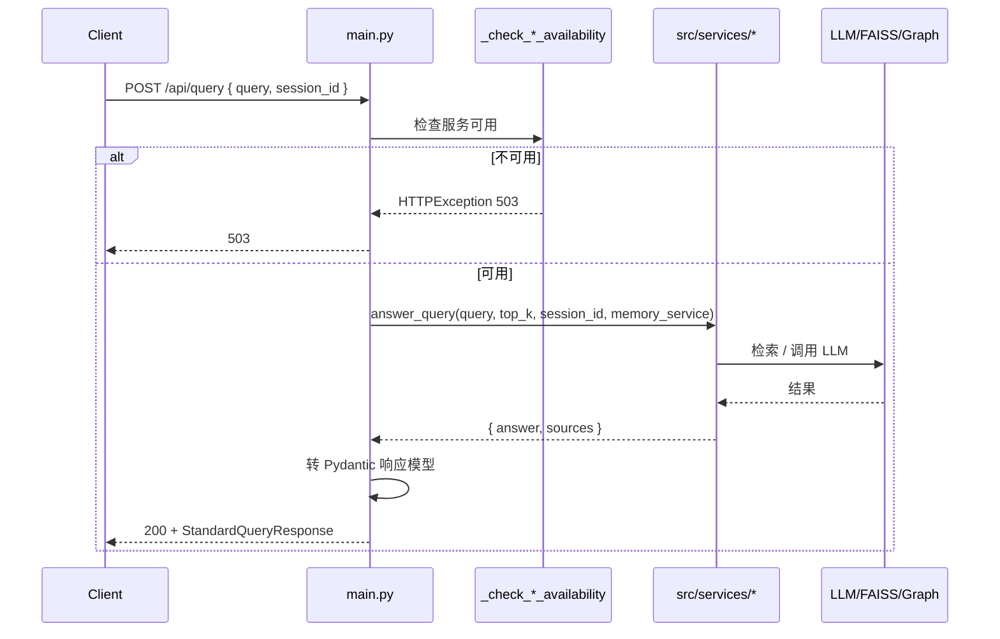

# 可复用工程设计摘要

本文档从 maven-rag 提炼可复用的**架构与目录/文件级设计**，便于在 agent-edu 中实现 Web、API、测试与脚本时参考。参考项目路径：`D:\PythonWorkSpace\maven-rag`。

---

## 1. 后端架构（FastAPI + 服务分层）

### 1.1 整体分层

- **入口**：`main.py` — FastAPI 应用、CORS、请求日志中间件、全局服务初始化。
- **请求/响应模型**：同一文件内 Pydantic `BaseModel`，按领域分组（RAG、Agent、GraphRAG、记忆、案例分析等）。
- **路由**：按功能打 `tags`，如 `tags=["RAG工作流"]`、`tags=["智能 Agent"]`；对话类统一接收 `query`、可选 `session_id`。
- **服务层**：`src/services/` 下各服务类（RAGService、AgentService、GraphRAGService、MemoryService 等），在 main 启动时单例初始化，失败时置为 None 并记录 startup_error，接口内通过 `_check_*_availability()` 统一返回 503。

### 1.2 配置与日志

- **配置**：`config/settings.py` — 从 `os.getenv` 与 `.env` 读取（BASE_DIR、DATA_DIR、各 JSON/索引路径、LLM/嵌入模型、API_HOST/PORT）；业务代码只引用 `settings.*`。
- **日志**：`config/logging_config.py` 在 main 最前执行 `setup_logging`；各模块 `logger = logging.getLogger(__name__)`；中间件可记录请求路径与耗时。

### 1.3 数据流（请求 → 响应）

---

## 2. 前端架构（React + Context + API 封装）

### 2.1 目录与职责

- **入口与路由**：`index.tsx` → `App.tsx`（AppProvider、Router、Layout、Routes）；路由表集中在一处（/、/query、/documents、/cases）。
- **布局**：`Layout` 包含侧边栏（Sidebar）+ 主内容区（flex-1 overflow-y-auto）；Sidebar 可折叠（collapsed）。
- **全局状态**：`contexts/AppContext.tsx` — 会话列表、当前会话、图谱状态、创建/切换/删除会话、更新会话元数据、localStorage 持久化与容量限制。
- **页面**：`pages/` — Home、Query（对话）、Documents、Cases；对话页承载多模式、输入、发送、流式状态、结果与图谱展示。
- **组件**：`components/legal/`（如 AnswerViewer）、`components/business/`（如 GraphVisualizer）、`components/layout/`（Sidebar）；按业务与布局拆分。
- **API**：`api/client.ts`（Axios 实例、baseURL）、`api/services.ts`（queryService.rag/agent/graphRag/agentStream、documentService、caseService、memory store）；前端只调 services，不直接写 URL。

### 2.2 对话页与流式

- **状态**：query、mode、loading、result、streamingAnswer、streamingSteps、currentEventSource；切换会话时关闭旧 EventSource。
- **模式**：RAG / LLM 增强 / Agent / GraphRAG / Agentic Traversal 对应不同 API 与参数；agentStream 使用 EventSource，按事件 type 分发（step_start、answer_chunk、complete、error）。
- **会话恢复**：currentConversation 变化时从 lastQuery、lastResult、lastGraph 恢复界面；新建会话时清空上述状态。

### 2.3 会话持久化

- **存储**：localStorage key 固定（如 `legal_conversations`）；保存前做数量上限（如 20）与单会话数据裁剪（如图谱节点数上限），避免 QuotaExceededError。
- **结构**：Conversation 含 id、title、updatedAt、lastQuery、lastResult、lastGraph 等；便于导出/分享时复用同一结构。

---

## 3. 测试设计

### 3.1 依赖隔离（conftest）

- **目的**：单元/集成测试不依赖 GPU、大模型、FAISS 等重环境。
- **做法**：在 `tests/conftest.py` 中、在导入任何服务前，用 `sys.modules['xxx'] = MagicMock()`  mock：sentence_transformers、faiss、torch、langchain 等；测试里按需 patch 更细粒度行为。

### 3.2 服务级单测

- **文件**：`test_*_service.py`（如 test_graph_service、test_memory_service、test_graph_rag_service、test_agentic_traversal_service）。
- **内容**：对服务类方法做输入-输出断言；fixture 提供最小数据；mock 下层依赖（LLM、向量库、图存储）。

### 3.3 集成测试

- **文件**：`test_integration_agentic.py`、`test_integration_graphrag.py`。
- **内容**：端到端流程（如 agentic_traversal 从入参到 answer + query_steps）；可依赖轻量数据或 mock 部分 IO。

### 3.4 需求追溯

- **文件**：`tests/REQUIREMENTS_TRACE.md`。
- **内容**：表格列“需求ID、需求描述、测试文件、测试用例、状态”；保证每条需求有对应用例，便于 8.3 属性类测试的用例设计。

---

## 4. 脚本与数据流水线

### 4.1 脚本分工

- **解析**：parse_legal_docs.py、parse_cases.py — 读原始数据（目录/文件），按格式分支，写统一 JSON。
- **转换**：convert_legal_text_to_json.py — 文本/条文分割、可选 LLM 关键词，输出结构化 JSON。
- **索引**：build_index.py — 读 JSON 分块、嵌入、写 FAISS + text_chunks.json；build_knowledge_index.py — 建目录索引 JSON；build_knowledge_graph.py — 建图 JSON。
- **测试**：run_api_smoke_tests.py — 读 API_EXAMPLES 或内置用例，发 HTTP 请求，写 API_TEST_LOG.md。

### 4.2 配置与路径

- 所有路径从 `config.settings` 读取（DATA_DIR、*_PATH），脚本内不写死；便于 agent-edu 换成 Chroma/Neo4j 路径。

---

## 5. 与 agent-edu 的适配要点

- **Web**：tasks 要求 Dash，maven-rag 为 React；若坚持 Dash，仅借鉴“页面划分、对话/会话/引用/图谱”的信息架构与交互逻辑；若允许 React，可复用上述前端结构。
- **API**：可直接复用 FastAPI + Pydantic + 服务分层 + 错误处理 + /docs；对话接口路径可定为 POST /api/chat，内部再调现有 Agent/Skill。
- **测试**：conftest 的 mock 策略、需求追溯表、服务/集成分层方式均可复用；属性基测试需自行用 hypothesis 等实现。
- **领域**：法律 vs 教育；RAG/图/记忆的**服务边界与接口形态**可复用，具体 schema 与业务逻辑需按教育场景改写。

以上为可复用工程设计摘要；具体文件路径见 [03_file_reference.md](03_file_reference.md)。
