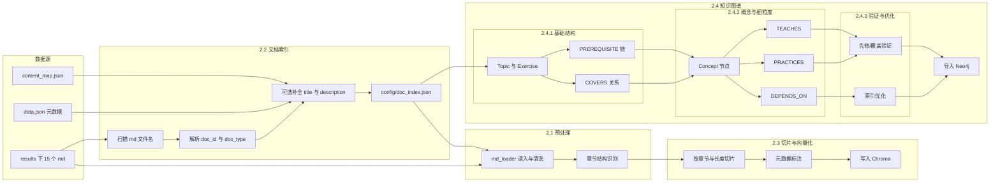
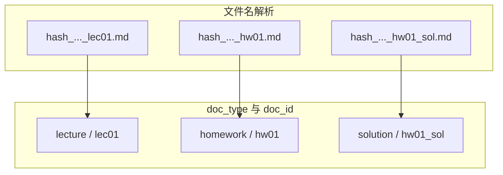
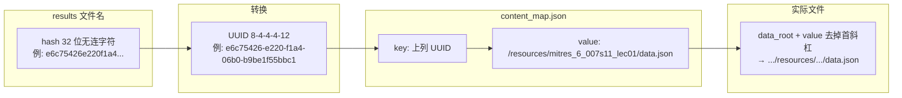
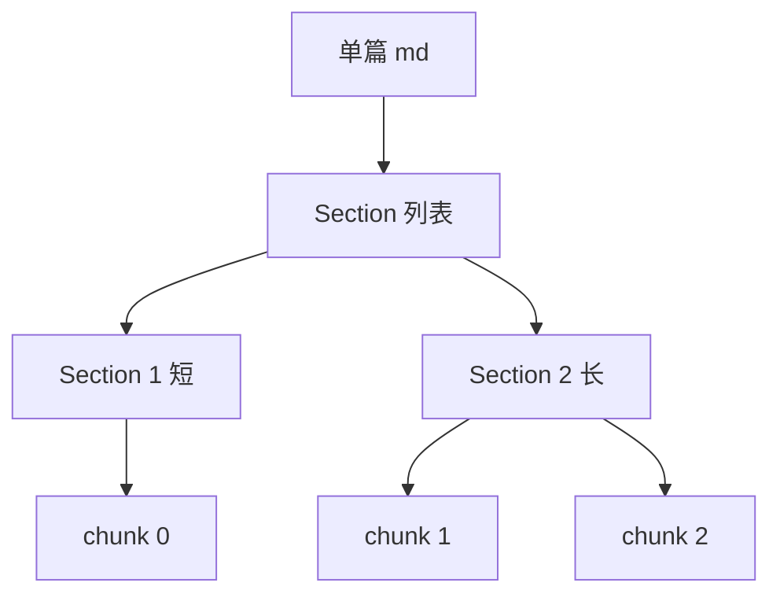
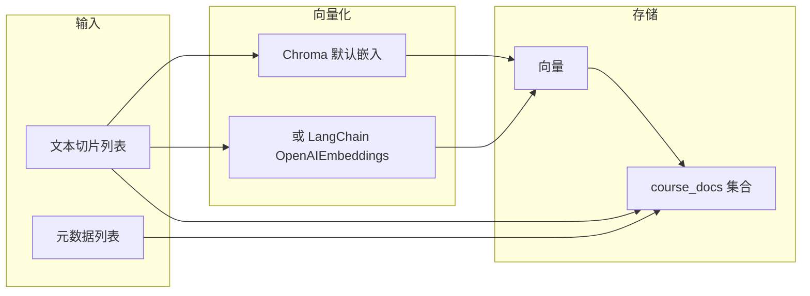
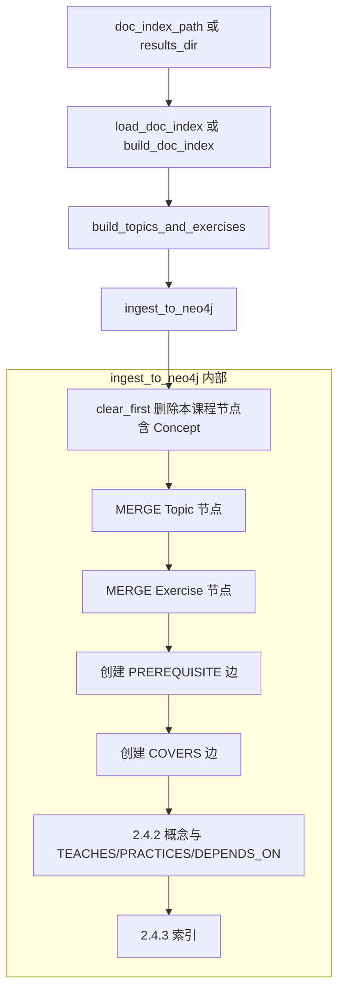
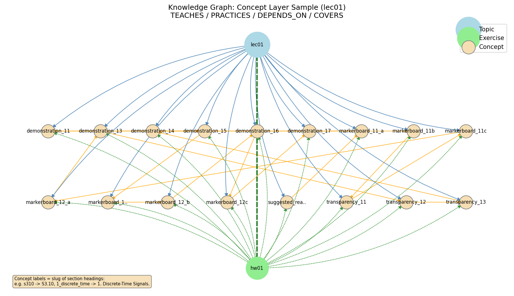

# 任务 2：数据预处理和知识库构建 — 实现思路整理

本文档整理「数据预处理和知识库构建」的实现思路，以 mermaid 图与测试结果辅助说明。数据源为 `results/` 下 15 个 `.md` 文件（lec01～lec05、hw01～hw05、hw01_sol～hw05_sol），暂不实现 PDF 转文本。

**任务2 完成内容概览**（任务与实现对应见 §7、§8）：

- **2.4.2 概念与关系**：`concepts.py` 从讲义章节标题抽取 Concept，建立 TEACHES/PRACTICES/DEPENDS_ON。
- **2.4.3 验证与索引**：`validate.py`、`scripts/validate_knowledge_graph.py` 提供先修链合理性、概念覆盖完整性验证及 Neo4j 索引创建。
- **导出脚本**：`scripts/export_knowledge_graph_figure.py` 支持默认 / full / sample；单讲图（`-c sample -l lec01`）两行布局 + 左下角图例。
- **文档与图**：本文档及任务2 相关图片、结果文件置于 **docs/task2/**。

---

## 1. 整体流程



---

## 1.5 常见疑问

- **用途**：知识图谱存**结构与关系**，主要给**推荐 Skill** 用——**PREREQUISITE** 查下一步学哪讲、约束不能跳过先修；**COVERS** 查某讲对应哪份作业，推荐巩固练习。内容检索与引用由 RAG（Chroma + 切片）负责，图负责「下一步学什么、练什么、是否合规」。
- **信息量**：2.4.1 为基础结构（Topic/Exercise、PREREQUISITE、COVERS）；2.4.2 增加概念层（Concept、TEACHES/PRACTICES/DEPENDS_ON），从讲义章节标题抽取，信息量已提升。
- **切片**：智能切片不体现在图上，产出用于 Chroma 供 RAG 检索；图从 doc_index 与规则构建，只展示整文档级节点与关系。切片可视化见 4.1。

---

## 2. 文档索引与分类（2.2）

对应 tasks 2.2.1～2.2.4。

### 2.2.1 思路

- 扫描 `results/*.md`，按文件名解析：`{hash}_MITRES_6_007S11_{lec01|hw01|hw01_sol}.md`。
- 将 32 位无连字符的 hash 转为 8-4-4-4-12 的 UUID，用 `data/res.6-007-spring-2011/content_map.json` 查对应 resource 路径，再读该路径下的 `data.json` 补全 `title`、`description`。
- 建立关联：讲义 ↔ 作业 ↔ 答案（如 lec01 ↔ hw01 ↔ hw01_sol）。

### 2.2.2 文件名与类型对应



### 2.2.3 content_map 中 hash→data.json 路径的映射示意

`results/` 下 .md 文件名为 `{hash}_MITRES_6_007S11_{doc_id}.md`，其中 hash 为 32 位无连字符的 UUID。补全 title/description 时需用 `data/res.6-007-spring-2011/content_map.json` 查表，其 **key** 为带连字符的 UUID（8-4-4-4-12），**value** 为 data.json 的相对路径。映射关系如下：



即：`hash_to_uuid(hash)` → `content_map[uuid_key]` 得到路径字符串 → `data_root / path.lstrip("/")` 得到 data.json 的完整路径，再读取其中的 `title`、`description`。

### 2.2.4 索引条目结构（示例）

索引中每条包含：`file_path`、`file_name`、`hash`、`doc_id`、`doc_type`、`lecture_index`、可选 `title`/`description`、`related_hw`/`related_sol`/`related_lec`。示例（来自 `config/doc_index.json`）：

| 字段 | 示例值 |
|------|--------|
| doc_id | lec04, hw04, hw04_sol |
| doc_type | lecture, homework, solution |
| title | Lecture 4, Convolution / Problem Set 4 / Problem Set 4 Solutions |
| related_lec / related_hw / related_sol | 按讲次与作业/答案对应 |

### 2.2.5 测试结果

见 §6 测试汇总。

---

## 3. 文本清洗与章节识别（2.1）

对应 tasks 2.1.2～2.1.3。

### 3.1 思路（2.1.2 / 2.1.3）

- **清洗**：统一换行、合并多余空行、去除 MIT OpenCourseWare 页脚块。
- **章节**：按 `#`、`##`、`###` 解析层级，得到每节的 level、title、start_line/end_line、start_offset/end_offset，供后续按节切片。

### 3.2 章节到切片的衔接


### 3.3 测试结果

见 §6 测试汇总。

---

## 4. 文档切片与向量化（2.3）

对应 tasks 2.3.1～2.3.3。

### 4.1 切片策略（2.3.1）

- 优先按 **章节边界**（`##` / `###`）切分。
- 单节超过约 800 字符时，再按 **长度 + 重叠**（设计 300～800 字符、重叠 50～100）二次切分。
- 避免在公式 `$$...$$` 或行内 `\(...\)` 中间切断；保证每次迭代 start 前进，避免死循环。
- **3.3.2 优化**：扩展公式边界检测（块公式 `\[...\]`、行内单 `$...$`），确保不在其内部切分；优先在段落边界（`\n\n`）切分，其次句子边界；避免在列表项（`- `）、表格行（`|`）中间切断。切片参数可通过环境变量配置：`SPLITTER_CHUNK_SIZE`、`SPLITTER_CHUNK_OVERLAP`、`SPLITTER_MAX_CHUNK`。

**单篇文档的“章节→切片”边界示意：** 以某篇讲义（如 lec01）为例，`parse_md_headings` 得到若干 Section（level、title、start_offset、end_offset）。`slice_document` 先按 Section 切：若某节长度 ≤ max_section_chars（默认 800），则该节对应 1 个 chunk；若超过，则对该节内容再按 `_split_by_size`（chunk_size=600、overlap=75）拆成多个 chunk。示意如下：



| 章节（section_title） | 该节字符数 | 对应切片（chunk_index） |
|-----------------------|------------|--------------------------|
| 1 Introduction        | 约 400     | chunk 0                  |
| Suggested Reading     | 约 200     | chunk 1                  |
| 某长节                 | 约 1500    | chunk 2, 3（按长度再分） |

同一文档的 `total_chunks` 为该文档的 chunk 总数，每个 chunk 的 metadata 中带 `section_title` 与 `chunk_index`。

### 4.2 切片元数据（2.3.2，与 design 对齐）

每个切片至少带：`source_file`、`doc_type`、`doc_id`、`section_title`、`chunk_index`、`total_chunks`、`content_type`，可选 `title`。Chroma 只接受标量 metadata，由 `chunk_metadata_for_chroma()` 做扁平化。

### 4.4 文档向量的生成方式（解释与可视化）

切片写入 Chroma 时，每条切片的文本会被转换为**向量（embedding）**再存储，便于后续按语义检索。本项目的两种方式如下。

**方式一：Chroma 默认嵌入（当前默认）**

不传入预计算向量时，Chroma 使用内置的默认嵌入模型（如 all-MiniLM-L6-v2）在服务端对 `documents` 做向量化，无需配置 API Key，适合本地/演示。

**方式二：LangChain Embeddings（可选）**

设置 `use_langchain_embeddings=True` 且配置 `OPENAI_API_KEY` 时，使用 `OpenAIEmbeddings` 在本地先对全部切片调用嵌入 API 得到向量，再与 `documents`、`metadatas` 一起写入 Chroma。适合需要统一嵌入模型或与后续 RAG 链一致时使用。

**从切片到向量的数据流：**



**检索时的使用方式：** 用户问题经同一套嵌入模型得到查询向量，Chroma 按余弦相似度返回最相似的若干切片及其 metadata（如 doc_id、section_title），供 RAG 生成回答与引用。

**嵌入维度与模型名：**

| 方式 | 模型 | 向量维度 |
|------|------|----------|
| Chroma 默认 | all-MiniLM-L6-v2（sentence-transformers） | 384 |
| LangChain OpenAIEmbeddings | text-embedding-3-small（默认）或配置指定 | 1536（small）等 |

**单条切片从文本到向量的示例：**

- **输入**：一段切片文本，例如约 200 字符的“This first lecture is intended to broadly introduce...”  
- **输出**：一个浮点向量。Chroma 默认时长度为 384；OpenAI 时由所选模型决定（如 1536）。  
- 同一切片、同一模型多次调用得到的向量一致，用于写入与检索时与查询向量做相似度比较。

### 4.5 测试结果

见 §6 测试汇总。

---

## 5. 知识图谱构建（2.4）

### 5.1 2.4.1 基础结构图谱

对应 tasks 2.4.1.1～2.4.1.4。

- **Topic**：从 5 个讲义生成 lec01～lec05，属性含 id、name、name_en、order、difficulty、description（来自 doc_index 的 title/description）。
- **Exercise**：hw01～hw05，属性含 id、title、difficulty、source、problem_type。
- **PREREQUISITE**：按讲次顺序 lec01 → lec02 → … → lec05，strength 固定 0.8。
- **COVERS**：lec0i 覆盖 hw0i，relevance 固定 0.9。

**从 doc_index 到 Topic/Exercise 的字段映射表：**

| 目标节点 | doc_index 来源 | 字段映射 |
|----------|----------------|----------|
| **Topic** | `doc_type == "lecture"` 的条目 | id←doc_id，name←doc_id，name_en←title，order←lecture_index，difficulty←"intermediate"，description←description |
| **Exercise** | `doc_type == "homework"` 的条目 | id←doc_id，title←title，difficulty←"intermediate"，source←"homework-{编号}"，problem_type←"mixed" |

**build_and_ingest_graph 的调用顺序：**



### 5.2 2.4.2 概念抽取与细粒度关系

对应 tasks 2.4.2.1～2.4.2.5。

- **Concept 节点来源**：从讲义 .md 的**章节标题**（`##` / `###`）抽取为概念候选，首版以规则为主（不依赖 LLM）。属性：`id`（如 `lec01_signals`）、`name`、`name_en`、`source_lecture`、`description`（可选）、`order`（同讲内顺序）。**概念覆盖范围（3.2.1）**：当前数据下「全部讲义」即 lec01～lec05，已全覆盖；若某讲无 section 或仅 level 1 标题，则生成兜底概念 `{doc_id}_overview`，保证每讲至少一个 Concept。
- **TEACHES**：`(Topic)-[:TEACHES]->(Concept)`，由该讲的 section 标题生成 Concept 并连到对应 Topic。
- **PRACTICES**：`(Exercise)-[:PRACTICES]->(Concept)`，首版按「hw0i 对应 lec0i 下全部概念」批量建立。
- **DEPENDS_ON**：同讲内按 section 顺序建 `(Concept A)-[:DEPENDS_ON]->(Concept B)`；跨讲采用「前一讲最后概念 → 下一讲第一概念」的简化链，后续可用 LLM 细化。

概念层示意（以 lec01 为例）。对应 2.4.2 概念与 TEACHES/PRACTICES/DEPENDS_ON。

**图例说明：**

| 元素 | 含义 |
|------|------|
| **节点颜色** | 浅蓝 = Topic（讲义，如 lec01）；浅绿 = Exercise（作业，如 hw01）；麦色 = Concept（概念，图中为章节标题的 slug） |
| **蓝色实线箭头** | TEACHES：讲义 → 概念，表示该讲讲授该概念 |
| **绿色虚线箭头** | PRACTICES：作业 → 概念，表示该作业练习该概念 |
| **橙色箭头** | DEPENDS_ON：概念 → 概念，表示先修顺序（同讲内按章节顺序） |
| **深绿粗虚线箭头** | COVERS：讲义 → 作业，表示 lec0i 覆盖 hw0i |

**示例（以图中概念 markerboard12a 为例）**：该节点对应概念 id `lec01_markerboard12a`，来自 lec01 中某节标题的 slug（如 "Marker Board 12a"）。若有一条**蓝色箭头**从 lec01 指向 markerboard12a，表示 lec01 **讲授**该概念（TEACHES）；若有一条**绿色虚线箭头**从 hw01 指向它，表示 hw01 **练习**该概念（PRACTICES）；若有一条**橙色箭头**从另一概念指向 markerboard12a，表示学习 markerboard12a 前需先掌握前一概念（DEPENDS_ON）。



实现位置：`src/knowledge_graph/concepts.py`（`extract_concepts_from_lecture`、`ingest_concepts_and_relations_to_neo4j`）；`build.py` 在写入 COVERS 后若提供 `doc_index` 与 `results_dir` 则调用概念抽取并写入 Neo4j；`clear_first` 时同时删除 Concept 及 TEACHES/PRACTICES/DEPENDS_ON。

### 5.3 2.4.3 图谱验证与优化

- **2.4.3.1 先修关系合理性**：`validate_prerequisite_chain(session)` 检查 PREREQUISITE 链是否连续（lec01→…→lec05）、无断链无反向，返回 (bool, 问题列表)。
- **2.4.3.2 概念覆盖完整性**：`validate_concept_coverage(session)` 检查每讲至少一个 Concept、每个 Topic 有 TEACHES 边，返回每讲概念数与缺失列表。
- **2.4.3.3 查询性能优化**：在 ingest 后为 `Topic.id`、`Concept.id`、`Exercise.id`、`Concept.source_lecture` 创建索引（`ensure_indexes(session)`）；推荐查询使用带索引属性（如 `t.id`）做 MATCH，避免全图扫描。

**验证结果示例：**

```text
先修链: 通过 []
概念覆盖: 通过 {'by_lecture': {'lec01': 17, ...}, 'missing_teaches': []}
```

---

## 6. 测试汇总

**测试汇总结果：**

```text
============================= test session starts =============================
platform win32 -- Python 3.13.5, pytest-8.4.2, pluggy-1.5.0 -- C:\Users\10489\miniconda3\python.exe
cachedir: .pytest_cache
rootdir: D:\Workspace\agent-edu
plugins: anyio-4.11.0, langsmith-0.4.34
collecting ... collected 11 items / 1 deselected / 10 selected

tests/test_doc_index.py::test_parse_md_filename PASSED                   [ 10%]
tests/test_doc_index.py::test_hash_to_uuid PASSED                        [ 20%]
tests/test_doc_index.py::test_build_doc_index_and_relations PASSED       [ 30%]
tests/test_doc_index.py::test_analyze_md_structure PASSED                [ 40%]
tests/test_doc_index.py::test_save_and_load_doc_index PASSED             [ 50%]
tests/test_md_loader.py::test_clean_md_text PASSED                       [ 60%]
tests/test_md_loader.py::test_parse_md_headings PASSED                   [ 70%]
tests/test_md_loader.py::test_load_md PASSED                             [ 80%]
tests/test_splitter.py::test_slice_document_and_metadata PASSED          [ 90%]
tests/test_knowledge_graph.py::test_build_topics_and_exercises PASSED    [100%]

====================== 10 passed, 1 deselected in 0.06s =======================
```

---

## 7. 模块与文件对应

| 任务项 | 模块/文件 | 说明 |
|--------|-----------|------|
| 2.2 文档索引 | `src/preprocessing/doc_index.py` | 扫描、解析、content_map/data.json 补全、保存 config/doc_index.json |
| 2.1.2 / 2.1.3 | `src/preprocessing/md_loader.py` | clean_md_text、parse_md_headings、load_md |
| 2.3.1 / 2.3.2 | `src/preprocessing/splitter.py` | 按章节与长度切片、元数据、chunk_metadata_for_chroma |
| 2.3.3 Chroma | `src/preprocessing/chroma_ingest.py` | 索引 → 切片 → 写入 Chroma 集合 course_docs |
| 2.4.1 基础图谱 | `src/knowledge_graph/build.py` | Topic/Exercise、PREREQUISITE、COVERS、Neo4j 导入 |
| 2.4.2 概念与关系 | `src/knowledge_graph/concepts.py` | Concept 抽取、TEACHES/PRACTICES/DEPENDS_ON |
| 2.4.3 验证与索引 | `src/knowledge_graph/validate.py`、`scripts/validate_knowledge_graph.py` | 先修/覆盖验证、索引创建 |

---

## 8. 与 tasks.md 的对应

| tasks.md 子项 | 实现方式 |
|---------------|----------|
| 2.1.1 PDF→文本 | 本阶段跳过，直接使用 results/*.md |
| 2.1.2 文本清洗和格式化 | md_loader.clean_md_text |
| 2.1.3 章节结构识别和标注 | md_loader.parse_md_headings、Section 结构 |
| 2.2.1 分析现有文档 | doc_index.analyze_md_structure、结构报告 |
| 2.2.2 建立文档索引 | doc_index.build_doc_index、config/doc_index.json |
| 2.2.3 分类和关联 | 文件名解析 doc_type/doc_id、related_* 字段 |
| 2.2.4 前 5 讲优先 | 15 个文件全部纳入（5 讲 + 5 作业 + 5 答案） |
| 2.3.1 智能切片 | splitter 按章节 + 长度与重叠、避免公式切断 |
| 2.3.2 元数据标注 | ChunkWithMeta、chunk_metadata_for_chroma |
| 2.3.3 Chroma 存储 | chroma_ingest.ingest_results_to_chroma、集合 course_docs |
| 2.4.1.1～2.4.1.4 基础结构图谱 | build_topics_and_exercises、ingest_to_neo4j、Topic/Exercise/PREREQUISITE/COVERS |
| 2.4.2.1～2.4.2.5 概念与细粒度关系 | concepts.extract_concepts_from_lecture、ingest_concepts_and_relations_to_neo4j、Concept/TEACHES/PRACTICES/DEPENDS_ON |
| 2.4.3.1 先修关系合理性 | validate.validate_prerequisite_chain、scripts/validate_knowledge_graph.py |
| 2.4.3.2 概念覆盖完整性 | validate.validate_concept_coverage |
| 2.4.3.3 查询性能优化 | validate.ensure_indexes、Topic/Concept/Exercise.id 索引 |

---

## 9. Task3 实现摘要（3.2 / 3.3）

### 9.1 知识图谱完善与可视化（3.2）

- **3.2.1**：无 section 讲义兜底概念 `{doc_id}_overview`（见 §5.2）；当前数据下全部讲义即 lec01～lec05 已全覆盖。
- **3.2.2**：PREREQUISITE 按讲次 strength 0.75（首尾）/ 0.85（中间）；DEPENDS_ON 增加属性 `type`（same_lecture / cross_lecture）、`weight`（1.0 / 0.8）；COVERS relevance 0.9；导出图图例中标注权重说明。
- **3.2.3**：Concept 增加 `difficulty`（按 section 顺序 basic / intermediate / advanced）；新增 `src/knowledge_graph/learning_path.py`：`get_learning_path_from_topic`、`get_learning_path_from_concept` 供推荐 Skill 调用。
- **3.2.4**：章节-切片映射由 `scripts/build_section_chunk_map.py` 生成 `config/section_chunk_map.json`；`scripts/export_section_structure_html.py` 生成 `docs/task2/section_structure.html`，展示每讲章节结构及切片在知识图谱中的定位（concept_id）。

### 9.2 数据质量优化（3.3）

- **3.3.1**：`src/preprocessing/dedup.py` 提供 `find_duplicate_chunks`（hash）、`dedup_chunks`；`chroma_ingest.ingest_results_to_chroma` 支持参数 `dedup_before_ingest`；`scripts/report_dedup.py` 输出重复率与样例至控制台及 `docs/task2/dedup_report.txt`。
- **3.3.2**：切片策略扩展公式边界（`\[...\]`、`$...$`）、避免列表/表格行中间切断；参数可通过环境变量 `SPLITTER_*` 配置（见 §4.1）。
- **3.3.3**：`src/preprocessing/quality_metrics.py` 计算每 doc chunk 数、平均/最小/最大长度、重复率、section 覆盖率；`scripts/report_quality.py` 输出 `docs/task2/quality_report.json` 与 `quality_report.md`。
