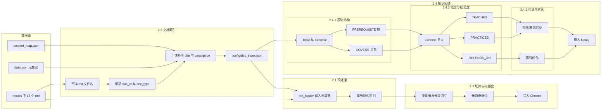
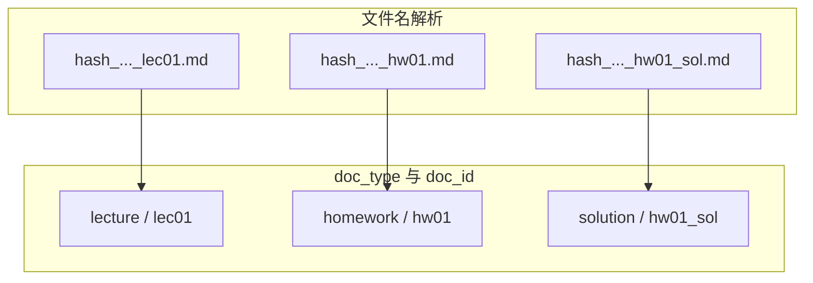
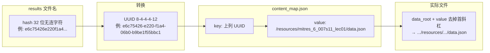
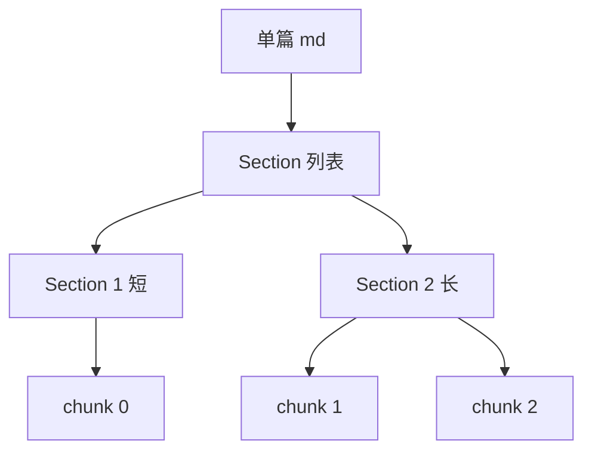
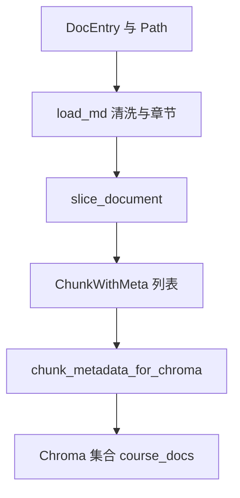
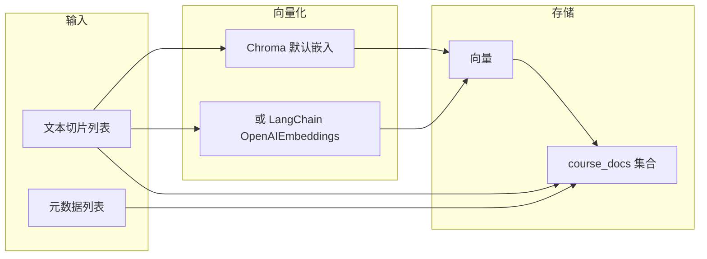
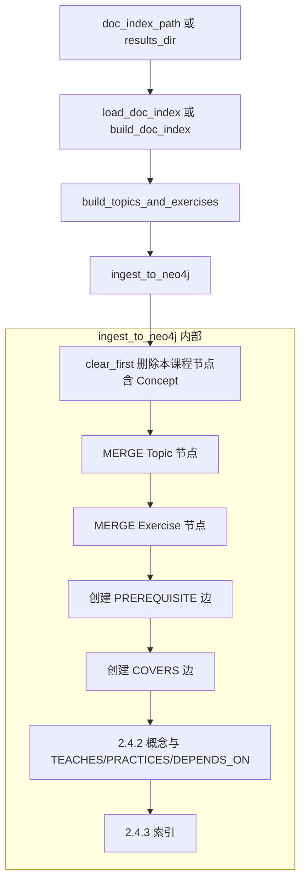
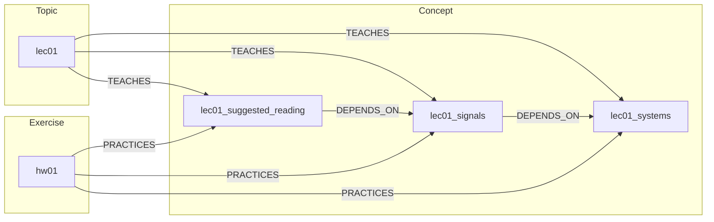
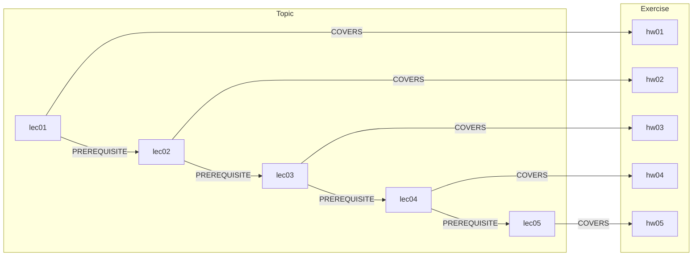
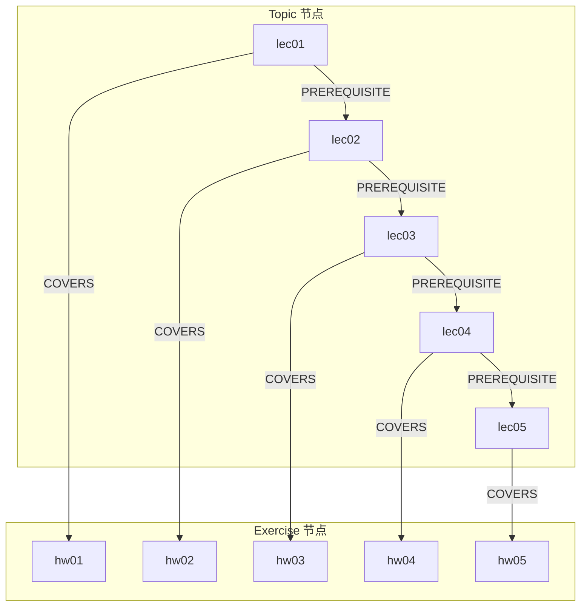

# 任务 2：数据预处理和知识库构建 — 实现思路整理

本文档整理「数据预处理和知识库构建」的实现思路，以 mermaid 图与测试结果辅助说明。数据源为 `results/` 下 15 个 `.md` 文件（lec01～lec05、hw01～hw05、hw01_sol～hw05_sol），暂不实现 PDF 转文本。

**任务2 完成内容概览（与讨论补充）：**

- **2.4.2 概念抽取与细粒度关系**：`concepts.py` 从讲义章节标题抽取 Concept，建立 TEACHES/PRACTICES/DEPENDS_ON；与 `build.py` 串联，`clear_first` 时一并清理 Concept 及新关系。
- **2.4.3 图谱验证与优化**：`validate.py` 提供先修链合理性、概念覆盖完整性验证及 Neo4j 索引创建；`scripts/validate_knowledge_graph.py` 可单独运行验证。
- **知识图谱导出脚本**：`scripts/export_knowledge_graph_figure.py` 支持三种模式——默认仅 Topic+Exercise；`-c full` 全量概念图；**`-c sample -l lec01`** 单讲示例图（可读性高，推荐）。单讲图采用概念分两行布局、边带弧度以减轻重叠，并在**左下角图例**中说明：概念节点标签为讲义章节标题的 slug（如 s310 对应 S3.10）。
- **运行入口**：`python -m src.knowledge_graph.build` 已通过包内延迟导入避免 RuntimeWarning；导入后自动执行 2.4.2 概念写入与 2.4.3 索引。
- 本文档及任务2 相关图片、结果文件统一置于 **docs/task2/** 目录下。

---

## 1. 整体流程



---

## 1.5 常见疑问：知识图谱信息量与智能切片体现

**问：知识图谱看起来没什么信息量？**

2.4.1 为基础结构：Topic/Exercise、PREREQUISITE（lec01→…→lec05）、COVERS（lec0i 覆盖 hw0i）。**2.4.2 已增加概念层与细粒度关系**：从讲义章节标题（`##`/`###`）抽取 **Concept** 节点，建立 **TEACHES**（讲义→概念）、**PRACTICES**（作业→概念）、**DEPENDS_ON**（概念→概念），信息量已提升；后续可再接 LLM 做概念归一化或跨讲依赖细化。

**问：智能文档切片在图上有没有体现？**

没有。智能切片（按章节边界、长度与重叠、避免公式切断）的产出用于 **Chroma 向量库**，供 RAG 检索；知识图谱是从 **doc_index**（文件级元数据）和约定规则构建的，不读取任何 chunk 内容。因此图只展示「整文档」级节点与关系，不展示「某讲被切成几块、每块对应哪一节」。若要体现切片，需要单独做「章节→切片」的可视化（如 4.1 中的示意）。

**问：知识图谱有什么用？**

在图里存的是**结构和关系**，主要给**推荐 Skill** 用：  
- **PREREQUISITE**：查「当前在 lec02 → 下一步学 lec03」、并约束「推荐不能跳过先修」；  
- **COVERS**：查「lec02 对应 hw02」，推荐「巩固练习：作业 2」。  
内容检索与引用由 **RAG（Chroma + 切片）** 负责，知识图谱负责「下一步学什么、练什么、是否合规」。当前图已包含概念层（2.4.2），可支撑按讲次、作业与概念的推荐；后续可用 LLM 细化概念依赖或按薄弱点推荐。

---

## 2. 文档索引与分类（2.2）

### 2.2.1 思路

- 扫描 `results/*.md`，按文件名解析：`{hash}_MITRES_6_007S11_{lec01|hw01|hw01_sol}.md`。
- 将 32 位无连字符的 hash 转为 8-4-4-4-12 的 UUID，用 `data/res.6-007-spring-2011/content_map.json` 查对应 resource 路径，再读该路径下的 `data.json` 补全 `title`、`description`。
- 建立关联：讲义 ↔ 作业 ↔ 答案（如 lec01 ↔ hw01 ↔ hw01_sol）。

### 2.2.2 文件名与类型对应



### 2.2.3 content_map 中 hash→data.json 路径的映射示意

`results/` 下 .md 文件名为 `{hash}_MITRES_6_007S11_{doc_id}.md`，其中 hash 为 32 位无连字符的 UUID。补全 title/description 时需用 `data/res.6-007-spring-2011/content_map.json` 查表，其 **key** 为带连字符的 UUID（8-4-4-4-12），**value** 为 data.json 的相对路径。映射关系如下：



即：`hash_to_uuid(hash)` → `content_map[uuid_key]` 得到路径字符串 → `data_root / path.lstrip("/")` 得到 data.json 的完整路径，再读取其中的 `title`、`description`。

### 2.2.4 索引条目结构（示例）

索引中每条包含：`file_path`、`file_name`、`hash`、`doc_id`、`doc_type`、`lecture_index`、可选 `title`/`description`、`related_hw`/`related_sol`/`related_lec`。示例（来自 `config/doc_index.json`）：

| 字段 | 示例值 |
|------|--------|
| doc_id | lec04, hw04, hw04_sol |
| doc_type | lecture, homework, solution |
| title | Lecture 4, Convolution / Problem Set 4 / Problem Set 4 Solutions |
| related_lec / related_hw / related_sol | 按讲次与作业/答案对应 |

### 2.2.5 运行与测试结果

**运行文档索引脚本：**

```text
$ python src/preprocessing/doc_index.py

Indexed 15 documents.
Saved to D:\Workspace\agent-edu\config\doc_index.json

Structure report (first 3):
{'file_name': '..._lec04.md', 'doc_id': 'lec04', 'doc_type': 'lecture', 'char_count': 12546, 'line_count': 230, 'headings': {'h1': 1, 'h2': 14, 'h3': 7}}
{'file_name': '..._hw04_sol.md', 'doc_id': 'hw04_sol', 'doc_type': 'solution', 'char_count': 16233, 'line_count': 429, 'headings': {'h1': 1, 'h2': 2, 'h3': 12}}
{'file_name': '..._lec03.md', 'doc_id': 'lec03', 'doc_type': 'lecture', 'char_count': 9334, 'line_count': 281, 'headings': {'h1': 1, 'h2': 6, 'h3': 22}}
```

**相关单元测试：**

```text
tests/test_doc_index.py::test_parse_md_filename PASSED
tests/test_doc_index.py::test_hash_to_uuid PASSED
tests/test_doc_index.py::test_build_doc_index_and_relations PASSED
tests/test_doc_index.py::test_analyze_md_structure PASSED
tests/test_doc_index.py::test_save_and_load_doc_index PASSED
```

---

## 3. 文本清洗与章节识别（2.1）

### 3.1 思路（2.1.2 / 2.1.3）

- **清洗**：统一换行、合并多余空行、去除 MIT OpenCourseWare 页脚块。
- **章节**：按 `#`、`##`、`###` 解析层级，得到每节的 level、title、start_line/end_line、start_offset/end_offset，供后续按节切片。

### 3.2 章节到切片的衔接


### 3.3 测试结果

```text
tests/test_md_loader.py::test_clean_md_text PASSED
tests/test_md_loader.py::test_parse_md_headings PASSED
tests/test_md_loader.py::test_load_md PASSED
```

---

## 4. 文档切片与向量化（2.3）

### 4.1 切片策略（2.3.1）

- 优先按 **章节边界**（`##` / `###`）切分。
- 单节超过约 800 字符时，再按 **长度 + 重叠**（设计 300～800 字符、重叠 50～100）二次切分。
- 避免在公式 `$$...$$` 或行内 `\(...\)` 中间切断；保证每次迭代 start 前进，避免死循环。

**单篇文档的“章节→切片”边界示意：** 以某篇讲义（如 lec01）为例，`parse_md_headings` 得到若干 Section（level、title、start_offset、end_offset）。`slice_document` 先按 Section 切：若某节长度 ≤ max_section_chars（默认 800），则该节对应 1 个 chunk；若超过，则对该节内容再按 `_split_by_size`（chunk_size=600、overlap=75）拆成多个 chunk。示意如下：



| 章节（section_title） | 该节字符数 | 对应切片（chunk_index） |
|-----------------------|------------|--------------------------|
| 1 Introduction        | 约 400     | chunk 0                  |
| Suggested Reading     | 约 200     | chunk 1                  |
| 某长节                 | 约 1500    | chunk 2, 3（按长度再分） |

同一文档的 `total_chunks` 为该文档的 chunk 总数，每个 chunk 的 metadata 中带 `section_title` 与 `chunk_index`。

### 4.2 切片元数据（2.3.2，与 design 对齐）

每个切片至少带：`source_file`、`doc_type`、`doc_id`、`section_title`、`chunk_index`、`total_chunks`、`content_type`，可选 `title`。Chroma 只接受标量 metadata，由 `chunk_metadata_for_chroma()` 做扁平化。

### 4.3 数据流（2.3.1～2.3.2）



### 4.4 文档向量的生成方式（解释与可视化）

切片写入 Chroma 时，每条切片的文本会被转换为**向量（embedding）**再存储，便于后续按语义检索。本项目的两种方式如下。

**方式一：Chroma 默认嵌入（当前默认）**

不传入预计算向量时，Chroma 使用内置的默认嵌入模型（如 all-MiniLM-L6-v2）在服务端对 `documents` 做向量化，无需配置 API Key，适合本地/演示。

**方式二：LangChain Embeddings（可选）**

设置 `use_langchain_embeddings=True` 且配置 `OPENAI_API_KEY` 时，使用 `OpenAIEmbeddings` 在本地先对全部切片调用嵌入 API 得到向量，再与 `documents`、`metadatas` 一起写入 Chroma。适合需要统一嵌入模型或与后续 RAG 链一致时使用。

**从切片到向量的数据流：**



**检索时的使用方式：** 用户问题经同一套嵌入模型得到查询向量，Chroma 按余弦相似度返回最相似的若干切片及其 metadata（如 doc_id、section_title），供 RAG 生成回答与引用。

**嵌入维度与模型名：**

| 方式 | 模型 | 向量维度 |
|------|------|----------|
| Chroma 默认 | all-MiniLM-L6-v2（sentence-transformers） | 384 |
| LangChain OpenAIEmbeddings | text-embedding-3-small（默认）或配置指定 | 1536（small）等 |

**单条切片从文本到向量的示例：**

- **输入**：一段切片文本，例如约 200 字符的“This first lecture is intended to broadly introduce...”  
- **输出**：一个浮点向量。Chroma 默认时长度为 384；OpenAI 时由所选模型决定（如 1536）。  
- 同一切片、同一模型多次调用得到的向量一致，用于写入与检索时与查询向量做相似度比较。

### 4.5 测试结果（2.3.3）

```text
tests/test_splitter.py::test_slice_document_and_metadata PASSED
```

Chroma 写入入口：`python -m src.preprocessing.chroma_ingest`（使用 Chroma 默认嵌入；可选 `use_langchain_embeddings=True` 使用 OpenAI）。

---

## 5. 知识图谱构建（2.4）

### 5.1 2.4.1 基础结构图谱

对应 tasks 2.4.1.1～2.4.1.4。

- **Topic**：从 5 个讲义生成 lec01～lec05，属性含 id、name、name_en、order、difficulty、description（来自 doc_index 的 title/description）。
- **Exercise**：hw01～hw05，属性含 id、title、difficulty、source、problem_type。
- **PREREQUISITE**：按讲次顺序 lec01 → lec02 → … → lec05，strength 固定 0.8。
- **COVERS**：lec0i 覆盖 hw0i，relevance 固定 0.9。

**从 doc_index 到 Topic/Exercise 的字段映射表：**

| 目标节点 | doc_index 来源 | 字段映射 |
|----------|----------------|----------|
| **Topic** | `doc_type == "lecture"` 的条目 | id←doc_id，name←doc_id，name_en←title，order←lecture_index，difficulty←"intermediate"，description←description |
| **Exercise** | `doc_type == "homework"` 的条目 | id←doc_id，title←title，difficulty←"intermediate"，source←"homework-{编号}"，problem_type←"mixed" |

**build_and_ingest_graph 的调用顺序：**



### 5.2 2.4.2 概念抽取与细粒度关系

对应 tasks 2.4.2.1～2.4.2.5。

- **Concept 节点来源**：从讲义 .md 的**章节标题**（`##` / `###`）抽取为概念候选，首版以规则为主（不依赖 LLM）。属性：`id`（如 `lec01_signals`）、`name`、`name_en`、`source_lecture`、`description`（可选）、`order`（同讲内顺序）。
- **TEACHES**：`(Topic)-[:TEACHES]->(Concept)`，由该讲的 section 标题生成 Concept 并连到对应 Topic。
- **PRACTICES**：`(Exercise)-[:PRACTICES]->(Concept)`，首版按「hw0i 对应 lec0i 下全部概念」批量建立。
- **DEPENDS_ON**：同讲内按 section 顺序建 `(Concept A)-[:DEPENDS_ON]->(Concept B)`；跨讲采用「前一讲最后概念 → 下一讲第一概念」的简化链，后续可用 LLM 细化。

**概念层与关系示意（一讲示例）：**



**概念层示意（以 lec01 为例）**：为避免全量概念图信息过载，文档采用「单讲示例图」展示概念与 TEACHES/PRACTICES/DEPENDS_ON。运行 `python scripts/export_knowledge_graph_figure.py -c sample -l lec01` 可生成本目录下 `knowledge_graph_concepts_sample_lec01.png`（可用 `-o docs/task2/xxx.png` 指定路径）。下图即由该命令生成（需已导入 Neo4j 概念数据）。图中概念节点标签为讲义章节标题的 **slug**（如 s310 即标题 S3.10、1_discrete_time 即 1. Discrete-Time Signals）；单讲图左下角有图例说明，概念采用两行布局以提升可读性。


实现位置：`src/knowledge_graph/concepts.py`（`extract_concepts_from_lecture`、`ingest_concepts_and_relations_to_neo4j`）；`build.py` 在写入 COVERS 后若提供 `doc_index` 与 `results_dir` 则调用概念抽取并写入 Neo4j；`clear_first` 时同时删除 Concept 及 TEACHES/PRACTICES/DEPENDS_ON。

### 5.3 2.4.3 图谱验证与优化

- **2.4.3.1 先修关系合理性**：`validate_prerequisite_chain(session)` 检查 PREREQUISITE 链是否连续（lec01→…→lec05）、无断链无反向，返回 (bool, 问题列表)。
- **2.4.3.2 概念覆盖完整性**：`validate_concept_coverage(session)` 检查每讲至少一个 Concept、每个 Topic 有 TEACHES 边，返回每讲概念数与缺失列表。
- **2.4.3.3 查询性能优化**：在 ingest 后为 `Topic.id`、`Concept.id`、`Exercise.id`、`Concept.source_lecture` 创建索引（`ensure_indexes(session)`）；推荐查询使用带索引属性（如 `t.id`）做 MATCH，避免全图扫描。

**验证脚本**：`python scripts/validate_knowledge_graph.py`（需配置 NEO4J_* 环境变量）；加 `--index` 或 `-i` 可仅创建/确认索引。示例输出：

```text
先修链: 通过 []
概念覆盖: 通过 {'by_lecture': {'lec01': 17, ...}, 'missing_teaches': []}
```

### 5.4 Neo4j 可视化与导出



使用环境变量 `NEO4J_URI`、`NEO4J_USER`、`NEO4J_PASSWORD`；可选 `clear_first=True` 先删除本课程相关节点（含 Concept）再写入。导入完成后，可在 **Neo4j Browser**（如 `http://localhost:7474`）中用 Cypher 查看和导出图谱，便于演示或报告插图。

**（1）查看完整课程图（Topic + Exercise + 关系）**

在 Neo4j Browser 中执行：

```cypher
MATCH (t:Topic)-[r]-(e)
WHERE t.id STARTS WITH 'lec' AND (e:Topic OR e:Exercise)
RETURN t, r, e
```

可看到 Topic、Exercise、PREREQUISITE 与 COVERS；若已导入 2.4.2 概念，还可查询 `MATCH (t:Topic)-[:TEACHES]->(c:Concept) RETURN t,c` 等。在结果面板选择「Graph」视图即可得到节点连线图，直接截图即可用作文档插图。

**（2）仅看先修链**

```cypher
MATCH path = (a:Topic)-[:PREREQUISITE*]->(b:Topic)
WHERE a.id STARTS WITH 'lec' AND b.id STARTS WITH 'lec'
RETURN path
```

**（3）仅看讲义与习题的覆盖关系**

```cypher
MATCH (t:Topic)-[r:COVERS]->(e:Exercise)
WHERE t.id STARTS WITH 'lec'
RETURN t, r, e
```

**图模型结构示意（与 Neo4j 中一致）：**



**导出为图片的建议：** 在 Neo4j Browser 的 Graph 视图中调整布局后，使用浏览器截图或 Neo4j 的导出功能；若需矢量图，可配合 Neo4j 的导出或第三方工具从 Cypher 结果生成图。

**脚本生成图（无需打开 Neo4j Browser）：** 运行 `python scripts/export_knowledge_graph_figure.py` 可从 Neo4j 读取图数据（若无数据则按预期结构 lec01～lec05、hw01～hw05 绘制），默认输出 `knowledge_graph.png`（可指定 `-o docs/task2/xxx.png` 保存到本目录）。`-c full` 输出全量概念图（易拥挤）；**`-c sample -l lec01`** 输出单讲示例图，可读性高，推荐用于文档；单讲图左下角有图例说明概念标签为章节标题的 slug。下图即由默认脚本生成：


**截图插入文档的步骤：** 在 Neo4j Browser 中执行上文中任一条 Cypher（推荐“查看完整课程图”），在结果区选择 **Graph** 视图，拖拽调整节点位置使先修链与 COVERS 关系清晰，使用系统截图（如 Win+Shift+S）或浏览器右键“截图”保存为 PNG，插入到本文档或报告即可。

**导出节点/边为 CSV 再绘图：** 若需在 Excel 或其他工具中绘图，可先用 Cypher 导出节点与边，再在外部制图。示例（在 Neo4j Browser 或 `cypher-shell` 中执行后导出为 CSV）：

```cypher
// 导出 Topic 节点（在 Browser 中执行后点 Export CSV）
MATCH (t:Topic) WHERE t.id STARTS WITH 'lec' RETURN t.id AS id, t.name_en AS name_en, t.order AS order;

// 导出 PREREQUISITE 边
MATCH (a:Topic)-[r:PREREQUISITE]->(b:Topic) WHERE a.id STARTS WITH 'lec'
RETURN a.id AS from_id, b.id AS to_id, 'PREREQUISITE' AS type;

// 导出 COVERS 边
MATCH (t:Topic)-[r:COVERS]->(e:Exercise) WHERE t.id STARTS WITH 'lec'
RETURN t.id AS from_id, e.id AS to_id, 'COVERS' AS type;
```

也可用 Python 脚本连接 Neo4j，执行上述查询并将结果写入 CSV，再用 pandas + 绘图库或 Graphviz 等生成图。

### 5.5 测试结果

```text
tests/test_knowledge_graph.py::test_build_topics_and_exercises PASSED
tests/test_knowledge_graph.py::test_build_and_ingest_graph_from_index SKIPPED  (NEO4J_PASSWORD 未设置时跳过)
```

Neo4j 导入入口：`python -m src.knowledge_graph.build`（需配置 .env 中的 Neo4j 连接；会一并执行 2.4.2 概念抽取与 2.4.3 索引；包内已采用延迟导入，避免以 `-m` 运行时的 RuntimeWarning）。验证入口：`python scripts/validate_knowledge_graph.py`（2.4.3.1 / 2.4.3.2）。

---

## 6. 测试汇总

在项目根目录执行：

```bash
python -m pytest tests/test_doc_index.py tests/test_md_loader.py tests/test_splitter.py tests/test_knowledge_graph.py -v
```

**实际运行结果：**

```text
============================= test session starts =============================
platform win32 -- Python 3.13.5, pytest-8.4.2, pluggy-1.5.0
collected 11 items

tests/test_doc_index.py::test_parse_md_filename PASSED                   [  9%]
tests/test_doc_index.py::test_hash_to_uuid PASSED                        [ 18%]
tests/test_doc_index.py::test_build_doc_index_and_relations PASSED       [ 27%]
tests/test_doc_index.py::test_analyze_md_structure PASSED                [ 36%]
tests/test_doc_index.py::test_save_and_load_doc_index PASSED             [ 45%]
tests/test_md_loader.py::test_clean_md_text PASSED                       [ 54%]
tests/test_md_loader.py::test_parse_md_headings PASSED                   [ 63%]
tests/test_md_loader.py::test_load_md PASSED                             [ 72%]
tests/test_splitter.py::test_slice_document_and_metadata PASSED          [ 81%]
tests/test_knowledge_graph.py::test_build_topics_and_exercises PASSED    [ 90%]
tests/test_knowledge_graph.py::test_build_and_ingest_graph_from_index SKIPPED [100%]

======================== 10 passed, 1 skipped in 0.07s ========================
```

---

## 7. 模块与文件对应

| 任务项 | 模块/文件 | 说明 |
|--------|-----------|------|
| 2.2 文档索引 | `src/preprocessing/doc_index.py` | 扫描、解析、content_map/data.json 补全、保存 config/doc_index.json |
| 2.1.2 / 2.1.3 | `src/preprocessing/md_loader.py` | clean_md_text、parse_md_headings、load_md |
| 2.3.1 / 2.3.2 | `src/preprocessing/splitter.py` | 按章节与长度切片、元数据、chunk_metadata_for_chroma |
| 2.3.3 Chroma | `src/preprocessing/chroma_ingest.py` | 索引 → 切片 → 写入 Chroma 集合 course_docs |
| 2.4.1 基础图谱 | `src/knowledge_graph/build.py` | Topic/Exercise、PREREQUISITE、COVERS、Neo4j 导入 |
| 2.4.2 概念与关系 | `src/knowledge_graph/concepts.py` | Concept 抽取、TEACHES/PRACTICES/DEPENDS_ON |
| 2.4.3 验证与索引 | `src/knowledge_graph/validate.py`、`scripts/validate_knowledge_graph.py` | 先修/覆盖验证、索引创建 |

---

## 8. 与 tasks.md 的对应

| tasks.md 子项 | 实现方式 |
|---------------|----------|
| 2.1.1 PDF→文本 | 本阶段跳过，直接使用 results/*.md |
| 2.1.2 文本清洗和格式化 | md_loader.clean_md_text |
| 2.1.3 章节结构识别和标注 | md_loader.parse_md_headings、Section 结构 |
| 2.2.1 分析现有文档 | doc_index.analyze_md_structure、结构报告 |
| 2.2.2 建立文档索引 | doc_index.build_doc_index、config/doc_index.json |
| 2.2.3 分类和关联 | 文件名解析 doc_type/doc_id、related_* 字段 |
| 2.2.4 前 5 讲优先 | 15 个文件全部纳入（5 讲 + 5 作业 + 5 答案） |
| 2.3.1 智能切片 | splitter 按章节 + 长度与重叠、避免公式切断 |
| 2.3.2 元数据标注 | ChunkWithMeta、chunk_metadata_for_chroma |
| 2.3.3 Chroma 存储 | chroma_ingest.ingest_results_to_chroma、集合 course_docs |
| 2.4.1.1～2.4.1.4 基础结构图谱 | build_topics_and_exercises、ingest_to_neo4j、Topic/Exercise/PREREQUISITE/COVERS |
| 2.4.2.1～2.4.2.5 概念与细粒度关系 | concepts.extract_concepts_from_lecture、ingest_concepts_and_relations_to_neo4j、Concept/TEACHES/PRACTICES/DEPENDS_ON |
| 2.4.3.1 先修关系合理性 | validate.validate_prerequisite_chain、scripts/validate_knowledge_graph.py |
| 2.4.3.2 概念覆盖完整性 | validate.validate_concept_coverage |
| 2.4.3.3 查询性能优化 | validate.ensure_indexes、Topic/Concept/Exercise.id 索引 |
