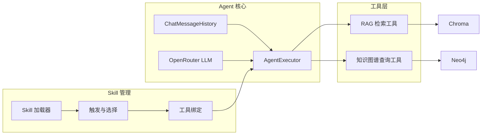

# Task4 实现说明

本文档归档 Task4（核心 Agent 系统开发，即 tasks.md 第 4 节 4.1～4.3）的完成思路、模块与入口、复现方式及本目录文件说明。

---

## 1. 范围

- **4.1 Agent 基础架构**：4.1.1 基于 LangChain 的 Agent 核心；4.1.2 OpenRouter LLM 集成；4.1.3 会话管理与上下文保持。
- **4.2 工具系统开发**：4.2.1 RAG 检索工具（文档检索、元数据过滤、排序筛选）；4.2.2 知识图谱查询工具（先修、COVERS、TEACHES/PRACTICES、学习路径验证）。
- **4.3 Skill 系统开发**：4.3.1 Skill 加载与管理；4.3.2 Skill 触发与选择逻辑；4.3.3 工具与 Skill 的绑定机制。

---

## 2. 完成思路

- **4.1.1**：使用 `create_tool_calling_agent` + `AgentExecutor`，prompt 含 `MessagesPlaceholder`（chat_history、agent_scratchpad），`max_iterations=15` 防止死循环；对外单入口 `invoke(session_id, user_message, tools, system_prompt)`。
- **4.1.2**：在 `src/agent/llm.py` 封装 `get_llm()`，从 `.env` 读取 `OPENROUTER_API_KEY`、`OPENROUTER_MODEL`，`openai_api_base` 指向 OpenRouter。
- **4.1.3**：`ChatMessageHistory` 按 `session_id` 维护；使用 `InMemoryChatMessageHistory`（langchain_core）；`RunnableWithMessageHistory` 包装 executor，`invoke` 时传入 `config={"configurable": {"session_id": ...}}`。
- **4.2.1**：`retrieve_documents(query, top_k, filters)` 封装 Chroma（集合 `course_docs`），支持 `doc_id`/`doc_type`/`content_type` 等元数据过滤；`@tool rag_retrieve` 供 Agent 调用，返回片段摘要文本。
- **4.2.2**：Neo4j 查询封装为四个工具：`graph_query_next_topic`（PREREQUISITE 下一讲）、`graph_query_covers_exercises`（COVERS 对应作业）、`graph_query_concept_relations`（TEACHES/PRACTICES）、`graph_validate_path`（先修路径验证）；复用 `knowledge_graph` 的 learning_path、validate 逻辑。
- **4.3.1**：扫描 `skills/*/SKILL.md`，解析 YAML frontmatter（name、description、trigger_keywords、allowed_tools、priority、body），维护内存注册表。
- **4.3.2**：按用户输入与各 Skill 的 `trigger_keywords` 做包含匹配；命中多个则按 priority 排序并合并 `allowed_tools`；未命中则使用全部工具。
- **4.3.3**：全局工具列表由 `get_all_tools()` 提供；按本回合 `allowed_tools` 用 `filter_tools_by_allowed` 筛选后传入 Agent；保证 SKILL.md 中工具名与 `@tool` 的 name 一致。
- **配置与入口**：`config/agent.yaml` 存通用 role/goal/backstory；`run.invoke_with_skills(user_message, session_id)` 完成「选 Skill → 绑工具 → 拼 system prompt → core.invoke」。

---

## 3. 架构示意（可视化）



可打开同目录下 `architecture.html` 查看上述架构图的可视化渲染。

---

## 4. 模块与入口一览

| 类型 | 路径 | 说明 |
|------|------|------|
| 模块 | `src/agent/llm.py` | OpenRouter LLM 封装 |
| 模块 | `src/agent/session.py` | 会话历史工厂与 RunnableWithMessageHistory 绑定 |
| 模块 | `src/agent/core.py` | build_agent_prompt、create_executor、invoke |
| 模块 | `src/agent/tools/rag.py` | retrieve_documents、rag_retrieve |
| 模块 | `src/agent/tools/graph.py` | 四个图谱 @tool 及 get_all_graph_tools |
| 模块 | `src/agent/skills/loader.py` | load_skills、get_skill_registry、get_skill |
| 模块 | `src/agent/skills/trigger.py` | select_skills_for_input |
| 模块 | `src/agent/skills/bind.py` | filter_tools_by_allowed |
| 入口 | `src/agent/run.py` | load_agent_system_prompt、invoke_with_skills |
| 配置 | `config/agent.yaml` | 通用 role、goal、backstory |
| Skill | `skills/qa/SKILL.md` | 答疑占位（allowed_tools: rag_retrieve） |
| Skill | `skills/exercise-recommend/SKILL.md` | 推荐练习占位（allowed_tools: graph_*） |
| 测试 | `tests/agent/test_skill_loader.py` | Skill 加载、触发、工具绑定 |
| 测试 | `tests/agent/test_agent_core.py` | prompt、executor、配置加载 |

---

## 5. 复现说明

在项目根目录执行：

```bash
# 单元测试（不依赖 Neo4j/Chroma/OpenRouter 的 Agent 与 Skill 测试）
pytest tests/agent/ -v
```

端到端单轮/多轮对话需：已写入 Chroma 的向量库、已导入 Neo4j 的图谱、`.env` 中 `OPENROUTER_API_KEY` 等；调用示例：

```python
from dotenv import load_dotenv
from pathlib import Path
load_dotenv(Path(".") / ".env")

from src.agent.run import invoke_with_skills

out = invoke_with_skills("什么是卷积？", session_id="test-session-1")
print(out["reply"], out["session_id"])
```

---

## 6. 本目录文件说明

| 文件 | 用途 |
|------|------|
| `task4_实现说明.md` | 本文档：完成思路、架构图、模块/入口、复现、文件索引 |
| `测试运行结果.txt` | `pytest tests/agent/ -v` 的完整控制台输出归档 |
| `architecture.html` | 架构图可视化（Mermaid 渲染），便于截图或演示 |

当前无 Web 界面，对话“截图”需在 Task6 完成 Dash 后，在浏览器中与助手对话并自行截图保存；本任务仅保留架构图与测试结果作为可交付可视化。
