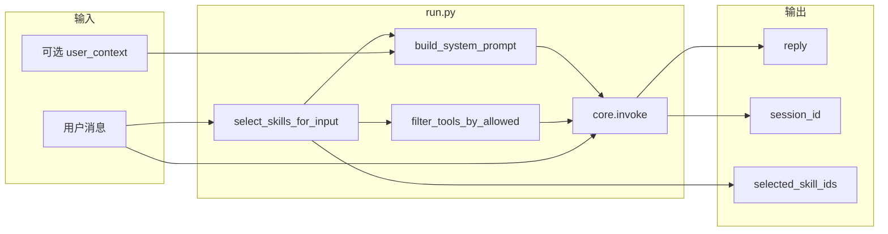

# Task5 实现说明

本文档归档 Task5（教育 Skill 实现与协同机制，即 tasks.md 第 5 节 5.1～5.3）的完成思路、模块与入口、复现方式及本目录文件说明。

---

## 1. 范围

- **5.1 答疑 Skill 开发**：配置文件、问题理解与分类、RAG 答案生成、引用格式化、苏格拉底式追问（可选）。
- **5.2 推荐练习 Skill 开发**：配置文件、基于知识图谱的推荐（PREREQUISITE/COVERS/DEPENDS_ON）、推荐理由、个性化推荐（user_context）。
- **5.3 Skill 协同机制**：多 Skill 同时触发、合并回答策略（先答疑后推荐）、结果合并与格式化、Skill 使用状态跟踪（selected_skill_ids）。

---

## 2. 完成思路

### 5.1 答疑 Skill

- **5.1.1**：在 `skills/qa/SKILL.md` 中补充 `trigger_keywords`（如「区别」「定义」），确认 `allowed_tools: ["rag_retrieve"]`。
- **5.1.2**：在 Skill 正文中增加「问题理解与分类」指引，要求模型先判断问题类型（概念解释/计算步骤/查找出处），再决定是否调用 RAG；以 prompt 引导为主，不引入单独分类服务。
- **5.1.3**：在 Skill 正文中明确「先调用 rag_retrieve 获取课程材料片段，再仅依据检索结果生成答案，不编造」。
- **5.1.4**：在 `src/agent/tools/rag.py` 的 `rag_retrieve` 返回中，将 `doc_id` 统一格式化为「第 N 讲」/「作业 N」（lec01→第1讲，hw01→作业1），并在开头增加引用格式说明；Skill 正文中写「回答中请注明：参见第 X 讲 / 章节 Y」。
- **5.1.5**：在答疑 Skill 正文中增加可选「苏格拉底式追问」说明：适当时可用引导性问题代替直接答案。

### 5.2 推荐练习 Skill

- **5.2.1**：确认 `skills/exercise-recommend/SKILL.md` 的 `allowed_tools` 包含全部图谱工具（含新增的 graph_query_concept_depends）。
- **5.2.2.1 / 5.2.2.2**：沿用既有 `graph_query_next_topic`（PREREQUISITE）、`graph_query_covers_exercises`（COVERS），无需改代码。
- **5.2.2.3**：在 `src/agent/tools/graph.py` 中新增 `query_concept_depends` 与 `@tool graph_query_concept_depends`，按 DEPENDS_ON 查询某概念的后继概念；在 `get_all_graph_tools` 与 `skills/exercise-recommend` 的 allowed_tools 中注册。
- **5.2.3**：在推荐 Skill 正文中明确「每次推荐须包含理由与对应知识点」，并给示例（如「因你刚学完 lec02，建议做 hw02 以巩固…」）；由 LLM 根据图谱工具返回生成理由。
- **5.2.4**：在 `invoke_with_skills` 中增加可选参数 `user_context`（如 `learned_topic_ids`）；在 `build_system_prompt` 中若传入则拼入「用户已学讲次」并提示使用 `graph_validate_path`。

### 5.3 Skill 协同

- **5.3.1**：多 Skill 同时触发的处理已由 `select_skills_for_input` 实现（返回多个 skill_id 并合并 allowed_tools）；在 `trigger.py` 的 docstring 中补充说明「多命中时合并 prompt 与工具」。
- **5.3.2**：在 `build_system_prompt` 中，当 `len(skill_bodies) > 1` 时，在拼接后的 system prompt 末尾追加：「若本回合同时涉及答疑与推荐，请先完整回答知识问题，再在单独段落给出学习/练习推荐。」
- **5.3.3**：在同一段协同说明中要求「回答结构可分段：先「答疑」再「推荐练习」」，可使用「## 答疑」「## 推荐练习」标题。
- **5.3.4**：在 `invoke_with_skills` 的返回值中增加 `selected_skill_ids: list[str]`，供前端或日志使用。

---

## 3. 架构与数据流示意（可视化）



可打开同目录下 `architecture.html` 查看上述架构图的可视化渲染。

---

## 4. 模块与入口一览

| 类型 | 路径 | 说明 |
|------|------|------|
| Skill | `skills/qa/SKILL.md` | 答疑 Skill：问题分类、RAG 流程、引用格式、苏格拉底追问 |
| Skill | `skills/exercise-recommend/SKILL.md` | 推荐练习 Skill：理由、路径验证、allowed_tools 含 graph_query_concept_depends |
| 模块 | `src/agent/tools/rag.py` | rag_retrieve 引用格式（第 X 讲/作业 N） |
| 模块 | `src/agent/tools/graph.py` | 新增 query_concept_depends、graph_query_concept_depends |
| 模块 | `src/agent/run.py` | build_system_prompt（user_context、多 Skill 协同）、invoke_with_skills（user_context、selected_skill_ids） |
| 模块 | `src/agent/skills/trigger.py` | docstring 补充多 Skill 合并说明 |
| 测试 | `tests/agent/test_agent_core.py` | test_build_system_prompt_multi_skill_and_user_context |
| 测试 | `tests/agent/test_skill_loader.py` | test_invoke_with_skills_returns_selected_skill_ids |

---

## 5. 复现说明

在项目根目录执行：

```bash
# 单元测试（不依赖 Neo4j/Chroma/OpenRouter）
pytest tests/agent/ -v
```

端到端单轮/多轮对话需：已写入 Chroma 的向量库、已导入 Neo4j 的图谱、`.env` 中 `OPENROUTER_API_KEY` 等。调用示例（含个性化推荐）：

```python
from dotenv import load_dotenv
from pathlib import Path
load_dotenv(Path(".") / ".env")

from src.agent.run import invoke_with_skills

# 仅答疑
out = invoke_with_skills("什么是卷积？", session_id="test-session-1")
print(out["reply"], out["selected_skill_ids"])

# 带已学讲次的推荐
out2 = invoke_with_skills(
    "推荐下一步练习",
    session_id="test-session-1",
    user_context={"learned_topic_ids": ["lec01", "lec02"]},
)
print(out2["reply"], out2["selected_skill_ids"])
```

---

## 6. 本目录文件说明

| 文件 | 用途 |
|------|------|
| `task5_实现说明.md` | 本文档：完成思路、数据流图、模块/入口、复现、文件索引 |
| `测试运行结果.txt` | `pytest tests/agent/ -v` 的完整控制台输出归档 |
| `architecture.html` | Task5 数据流/架构图可视化（Mermaid 渲染），便于截图或演示 |

当前无 Web 界面，对话截图需在 Task6 完成 Dash 后，在浏览器中与助手对话并自行截图保存；本任务以架构图与测试结果作为可交付可视化。
