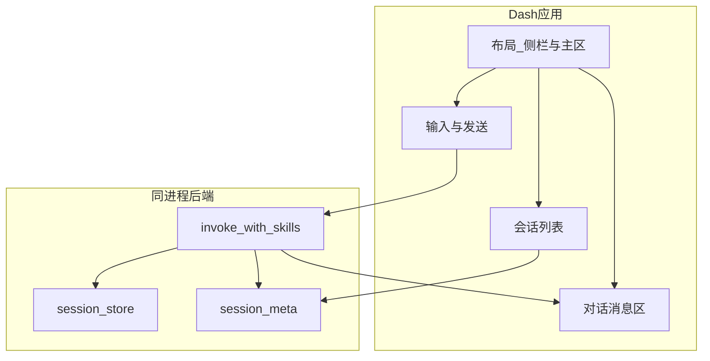

# Task6 实现说明

本文档归档 Task6（Web 界面开发，即 tasks.md 第 6 节 6.1～6.4）的完成思路、模块与入口、复现方式、可视化截图方法及本目录文件说明。

---

## 1. 范围

- **6.1 Dash 应用基础框架**：6.1.1 主框架；6.1.2 响应式布局（侧栏 + 主区）；6.1.3 基础样式与主题（dash-bootstrap-components FLATLY）。
- **6.2 对话界面实现**：6.2.1 聊天消息显示（用户/助手区分、Markdown 渲染）；6.2.2 输入框与发送；6.2.3 实时状态（dcc.Loading）。
- **6.3 结果展示功能**：6.3.1 引用来源（整段 reply 的 Markdown）；6.3.2 推荐内容卡片（## 推荐练习 段落用 dbc.Card）；6.3.3 Skill 使用状态指示器（selected_skill_ids 用 dbc.Badge）。
- **6.4 会话管理功能**：6.4.1 多会话标签页（侧栏会话列表、切换）；6.4.2 会话历史保存和加载（data/sessions/sessions.json）；6.4.3 会话导出（JSON 下载）。

---

## 2. 完成思路

### 6.1 Dash 应用基础框架

- **6.1.1**：在 `src/web/app.py` 中创建 `Dash(__name__, external_stylesheets=[dbc.themes.FLATLY])`，布局由 `layout.build_layout()` 提供；`if __name__ == "__main__"` 中 `app.run(host="0.0.0.0", port=8050, debug=True)`。
- **6.1.2**：`src/web/layout.py` 使用 `dbc.Container` + `dbc.Row`/`dbc.Col`：侧栏 Col（会话列表、新建会话）、主区 Col（消息区、输入区、导出按钮）；侧栏与主区均为响应式宽度（如 lg=3 / lg=9）。
- **6.1.3**：主题使用 `dbc.themes.FLATLY`；可选自定义样式放在 `src/web/assets/custom.css`。

### 6.2 对话界面实现

- **6.2.1**：消息列表由 `dcc.Store(id="messages-store")` 驱动；`render_messages` callback 根据 `messages` 数据渲染每条为 `dcc.Markdown`，用户消息右对齐（dbc.Card outline），助手消息左对齐。
- **6.2.2**：`dcc.Textarea`（id="user-input"）+ `dbc.Button`「发送」；发送 callback 读取 input、调用 `invoke_with_skills`、追加 user/assistant 消息到当前会话的 messages、清空输入并短暂禁用发送按钮。
- **6.2.3**：主区使用 `dcc.Loading` 包裹占位；发送 callback 的输出包含该 Loading 的 children，请求期间由 Dash 自动显示加载状态。

### 6.3 结果展示功能

- **6.3.1**：当前 Agent 未返回独立 sources 数组，引用写在 reply 文本中；首版用 **Markdown 渲染整段 reply** 体现「参见第 X 讲 / 章节 Y」。
- **6.3.2**：对助手消息的 content 按 `## 推荐练习` 分段，该段落用 `dbc.Card`（CardHeader + CardBody）做卡片式展示。
- **6.3.3**：每条助手消息附带 `selected_skill_ids`，在消息下方用 `dbc.Badge` 展示（如「qa」「exercise-recommend」）。

### 6.4 会话管理功能

- **6.4.1**：侧栏渲染会话列表（由 `sessions-meta-store` 驱动），每项为 `dbc.Button`，id 为 `{"type": "session-btn", "index": session_id}`；点击触发 `switch_session` callback，更新 `current-session-store` 与 `messages-store`，并调用 `_save_sessions` 持久化当前选中会话 id。
- **6.4.2**：首次加载时 `init_default_session` 从 `data/sessions/sessions.json` 读取并恢复会话列表与当前会话；发送、新建会话、切换会话后调用 `_save_sessions` 写回；单会话消息数与会话总数有上限（如 100 条/会话、20 个会话）避免体积过大。
- **6.4.3**：「导出当前会话」按钮触发 `export_session` callback，将当前会话的 id、title、updated_at、messages 序列化为 JSON，通过 `dcc.send_string` 触发浏览器下载。

---

## 3. 架构与数据流示意（可视化）



可打开同目录下 `architecture.html` 查看上述架构图的可视化渲染。

---

## 4. 模块与入口一览

| 类型 | 路径 | 说明 |
|------|------|------|
| 入口 | `src/web/app.py` | Dash 应用实例、callbacks、session_store/session_meta、_load_sessions/_save_sessions |
| 布局 | `src/web/layout.py` | build_layout、侧栏/主区、Store/按钮/输入/下载 id 常量 |
| 包 | `src/web/callbacks/` | 占位（当前 callbacks 均在 app.py 内） |
| 资源 | `src/web/assets/custom.css` | 可选自定义样式 |
| API 入口 | `src/api/app.py` | FastAPI：对话、会话管理、系统状态（tasks 7.1–7.3），与 data/sessions 共享存储 |
| 依赖 | `requirements.txt` | dash、dash-bootstrap-components、fastapi、uvicorn、httpx 等 |

---

## 5. 复现说明

在项目根目录执行：

```bash
# 安装依赖
pip install -r requirements.txt

# 启动 Dash（需已配置 .env、Chroma、Neo4j 等以便对话时调用 Agent）
python -m src.web.app
```

终端出现 “Dash is running on http://0.0.0.0:8050/” 后，在浏览器中访问 **http://127.0.0.1:8050/** 或 **http://localhost:8050/**。注意：请勿在浏览器地址栏输入 `http://0.0.0.0:8050/`，否则可能出现 ERR_ADDRESS_INVALID。

**API 服务（tasks 7.x）**：可选单独启动，与 Dash 共用 `data/sessions/sessions.json`。

```bash
uvicorn src.api.app:app --host 0.0.0.0 --port 8000
```

API 文档：http://127.0.0.1:8000/docs ；健康检查：http://127.0.0.1:8000/api/health 。

---

## 6. 可视化截图方法

**承接说明**：Task3/4/5 实现说明中约定：对话截图需在 Task6 完成 Dash 后，在浏览器中与助手对话并自行截图保存；本节即该约定的截图方法说明。

**步骤**：

1. **启动**：在项目根目录执行 `python -m src.web.app`，确认终端输出 “Dash is running on …”。
2. **访问**：浏览器打开 **http://127.0.0.1:8050/**（或 http://localhost:8050/）。
3. **建议截图场景**：
   - 首次进入：默认会话、空消息列表；
   - 答疑：发送一条如「什么是卷积？」或「傅里叶变换的定义」，截取问答内容、引用表述及 Skill 标签（如 qa）；
   - 推荐：发送「推荐下一步练习」或「我学了第1讲，该做什么题」，截取「推荐练习」卡片与 Skill 标签（如 exercise-recommend）；
   - 多会话：点击「新建会话」、在侧栏切换会话；
   - 导出：点击「导出当前会话」，确认 JSON 下载。
4. **截图保存**：建议文件名如 `task6_chat_qa.png`、`task6_recommend_card.png`、`task6_sessions_export.png`，可放在 `docs/task6/` 或统一截图目录。

**与 task3/4/5 的对应**：task4、task5 中“当前无 Web 界面，对话截图需在 Task6 完成 Dash 后…”的约定，由本任务实现；上述步骤即满足该约定所需的截图方法。task3 的可视化以 HTML/图谱为主，task6 补充“在浏览器中与助手对话”的截图方式。

---

## 7. 本目录文件说明

| 文件 | 用途 |
|------|------|
| `task6_实现说明.md` | 本文档：完成思路、数据流图、模块/入口、复现、可视化截图方法、文件索引 |
| `测试运行结果.txt` | 运行与手动冒烟测试说明及结果归档（可选粘贴控制台输出） |
| `architecture.html` | Task6 Web 数据流/架构图可视化（Mermaid 渲染），便于截图或演示 |
| `task6_chat_qa.png` 等 | 按需保存的截图（答疑、推荐卡片、多会话、导出等），命名见上文 |
